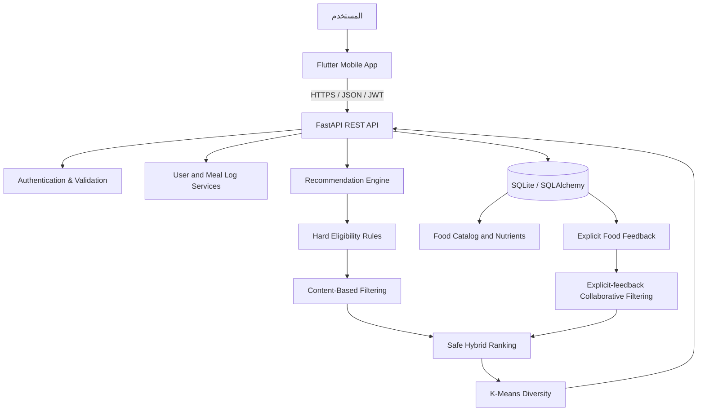

# التوثيق العملي النهائي

## نظام ذكي لتوصية وجبات وخطط غذائية شخصية باستخدام تقنيات تعلم الآلة والقواعد الغذائية

**إعداد:** Hashem Teeka  
**نوع الوثيقة:** فصل عملي وتقني جاهز للاقتباس في تقرير مشروع التخرج  
**حالة الشفرة الموثقة:** فرع `feat/feedback-cf-swagger-performance`، متضمنًا التغييرات حتى commit `0e1a1fa`  
**حدود النظام:** نظام دعم قرار واقتراح غذائي؛ لا يقدم تشخيصًا طبيًا أو وصفات علاجية أو بديلًا عن اختصاصي تغذية.

---

## 1. هدف التنفيذ العملي

يحوّل هذا الجزء الفكرة النظرية للمشروع إلى نظام قابل للتشغيل يتكون من تطبيق هاتف، وخدمة خلفية، وقاعدة بيانات غذائية، ومحرك توصية هجين. يستقبل النظام بيانات المستخدم الأساسية وهدفه وتفضيلاته وقيوده المعلنة، ثم يرشح الأطعمة غير المتعارضة مع القيود، ويرتب العناصر المتبقية، ويولد اقتراحات لوجبات وخطط أسبوعية قابلة للتفسير.

> **مبدأ التصميم الأساسي:** لا يسمح لأي درجة ناتجة عن نموذج تعلم آلي بتجاوز قاعدة حساسية أو قيد صلب. تمر كل التوصيات بمرحلة الأهلية الآمنة أولًا، ثم بمرحلة الترتيب والتنويع.

| الهدف العملي | آلية التنفيذ |
|---|---|
| تخصيص الاقتراح | ملف مستخدم يضم البيانات الجسمية والهدف والنشاط والتفضيلات والقيود. |
| العمل مع مستخدم جديد | `Content-Based Filtering` بوصفه المسار الافتراضي للبدء البارد. |
| التعلم من التفضيل الحقيقي | تفاعلات صريحة: `like` و`save` و`dislike` و`not_interested`. |
| منع التوصيات المخالفة | فلترة صلبة للحساسية وعدم الرغبة وملاءمة نوع الوجبة قبل الترتيب. |
| تقليل تكرار الخطة | تجميع K-Means للأطعمة بحسب الملف الغذائي واستخدامه للتنوع الناعم. |
| إيضاح سبب الاقتراح | حقول `recommendation_reason` و`recommendation_reasons` و`diversity_applied`. |
| سهولة الربط والاختبار | REST API موثق تلقائيًا عبر Swagger/OpenAPI واختبارات وحدة وتكامل. |

---

## 2. معمارية النظام والتنقل بين الطبقات

يتبع المشروع معمارية عميل–خادم. يمثل تطبيق Flutter طبقة العرض والتفاعل، بينما تمثل FastAPI طبقة الخدمات والعقود، وتحتوي Python على منطق التوصية وقواعد الوجبات. تُدار البيانات بواسطة SQLAlchemy وترحيلات Alembic. يسمح هذا الفصل باختبار المنطق دون تشغيل واجهة الهاتف، وباستبدال SQLite بـPostgreSQL مستقبلًا من دون تغيير مفهوم النظام.



| الطبقة | التقنيات | المسؤولية |
|---|---|---|
| الواجهة | Flutter، Dart، Riverpod، Dio، go_router | الشاشات، حالة التطبيق، واستدعاء API. |
| الخدمة | FastAPI، Pydantic، JWT، SlowAPI | التحقق، المصادقة، عقود JSON، والتوثيق التفاعلي. |
| البيانات | SQLAlchemy، Alembic، SQLite | نماذج البيانات والعلاقات والترحيلات. |
| الذكاء الاصطناعي | pandas، NumPy، scikit-learn | CBF وCosine Similarity وCF وK-Means. |
| الاختبار | pytest وFastAPI TestClient | اختبارات الوحدة والتكامل وترحيلات المخطط. |

تنتج FastAPI مخطط OpenAPI ووثائق Swagger UI وReDoc تلقائيًا عند توصيف المسارات ونماذج الطلب والاستجابة [1] [2]. هذه الميزة تستخدم في اختبار الواجهات وربط تطبيق الهاتف دون الحاجة إلى تخمين أسماء الحقول أو أنواعها.

---

## 3. بنية المستودع ومسؤوليات الملفات

تقسم الملفات حسب المهمة لتجنب خلط إعداد البيانات مع API أو مع واجهة الهاتف. يعرض الجدول التالي الملفات الأكثر ارتباطًا بالفصل العملي؛ ولا يحتاج التقرير إلى عرض كل الملفات الثانوية.

| المسار أو الملف | الاستخدام الفعلي |
|---|---|
| `02_collect_data.py` | جمع الأطعمة من USDA FoodData Central وإضافة أطعمة محلية. |
| `03_clean_data.py` | تنظيف البيانات وتوحيد أسماء الأعمدة والقيم. |
| `05_user_profiler.py` | بناء ملف المستخدم وحساب مؤشرات واحتياجات تقريبية. |
| `06_kmeans_model.py` | استكشاف أولي للتجميع غير المراقب. |
| `07_cbf_model.py` | بناء أو تحميل نموذج التوصية المعتمد على المحتوى. |
| `09_hybrid_recommender.py` | تكوين الوجبات والخطة الأسبوعية ودمج التنوع. |
| `meal_rules.py` | قوالب الوجبات والحصص وقواعد الأهلية الصلبة. |
| `recommender_engine.py` | واجهة منطقية موحدة للتوصية والبدائل والاستبدال. |
| `api/services/recommendation_policy.py` | دوال نقية وقابلة للاختبار للمزج والتجميع والتنوع والتفسير. |
| `api/services/feedback_collaborative_filter.py` | CF معتمد على التفاعل الصريح وبوابة الجاهزية. |
| `api/routes/recommendations.py` | مسارات توصية الوجبة والخطة والبدائل والاستبدال. |
| `api/routes/users.py` | الملف الشخصي وسجل الوجبات والتفاعل الصريح وفحص الجاهزية. |
| `api/db_models.py` | نماذج SQLAlchemy للجداول والعلاقات والقيود. |
| `api/migrations/versions/` | ملفات Alembic الإصدارية. |
| `api/tests/` | اختبارات خوارزميات وسياسات ومسارات API وترحيلات. |
| `app/` | مشروع Flutter؛ يحوي `lib/` للشاشات والخدمات ومزودات الحالة. |

---

## 4. إعداد وتشغيل المشروع محليًا

### 4.1 المتطلبات

يعتمد الخادم على Python 3.12، ويعتمد تطبيق الهاتف على Flutter وDart. يجب إنشاء ملف متغيرات بيئة محلي وإبقاؤه خارج Git. لا يرفع مفتاح USDA أو مفتاح توقيع JWT أو رابط قاعدة بيانات إنتاج إلى المستودع العام.

| العنصر | الاستخدام |
|---|---|
| Python وبيئة افتراضية | عزل تبعيات FastAPI وscikit-learn والاختبارات. |
| `requirements-deploy.txt` | تبعيات تشغيل الخادم. |
| `requirements-dev.txt` | تبعيات الاختبارات والتطوير. |
| `api/requirements_api.txt` | مرجع تبعيات API عند الحاجة. |
| `.env` | الإعدادات والأسرار المحلية غير المتعقبة. |
| `app/pubspec.yaml` | تبعيات Flutter. |

### 4.2 تشغيل الخادم وقاعدة البيانات

ينفذ المثال التالي من جذر المستودع. تختلف طريقة تفعيل البيئة الافتراضية في Windows، لكن تسلسل الأوامر يبقى نفسه.

```bash
python -m venv .venv
source .venv/bin/activate
pip install -r requirements-deploy.txt
pip install -r requirements-dev.txt
alembic upgrade head
uvicorn api.main:app --reload
```

بعد التشغيل تكون الوثائق متاحة على `/docs`، وواجهة ReDoc على `/redoc`، وملف OpenAPI على `/openapi.json`. ينبغي تطبيق الترحيلات قبل تشغيل الخدمة في أي بيئة جديدة، حتى يصبح شكل قاعدة البيانات محددًا وقابلًا لإعادة الإنتاج.

### 4.3 تشغيل تطبيق Flutter

يتم تنفيذ أوامر Flutter من مجلد `app/`. يجب ضبط عنوان الخادم بحسب الجهاز أو المحاكي؛ فـ`localhost` في الهاتف أو المحاكي لا يعني بالضرورة جهاز التطوير نفسه.

```bash
cd app
flutter pub get
flutter run
```

---

## 5. قاعدة البيانات والترحيلات

### 5.1 سبب استخدام Alembic

لا يعتمد المشروع على إنشاء أو تعديل الجداول بصمت عند بدء التطبيق. بدلاً من ذلك، يحفظ كل تغيير بنيوي في ملف Alembic مستقل، بما يضمن أن أي مطور أو مقيم للمشروع يستطيع إنشاء نفس المخطط من الصفر أو ترقية قاعدة قديمة تدريجيًا.

| الترحيل | الأثر المنفذ |
|---|---|
| `786a3450d5e4` | المخطط الأولي للمستخدمين وسجل الوجبات والخطط. |
| `0f209686ddbd` | كتالوج الطعام والمصادر والمغذيات والحصص والمكونات والحساسية. |
| `a298050d9bcf` | جدول التفاعل الصريح مع الطعام وقيوده. |
| `c4b2e8f1d9a0` | قيود سلامة ملف المستخدم: العمر والوزن والطول والنشاط واتساق الوزن مع الطول. |

يتم التحقق من صحة المخطط بالأوامر التالية:

```bash
alembic upgrade head
alembic check
pytest api/tests/test_database_migrations.py -q
```

### 5.2 مجموعات الجداول

| المجموعة | الجداول الرئيسة | الدور |
|---|---|---|
| الحساب والملف | `users` | بيانات المستخدم والهدف والنشاط والحساسية والتفضيلات. |
| الاستهلاك | `meal_logs` | ما سجله المستخدم أنه تناوله، مع الحصة والمغذيات. |
| الخطة | `weekly_plans` | الخطط الأسبوعية المولدة وحالة التبديلات. |
| مصدر الطعام | `catalog_sources` | تتبع المصدر والإصدار وتاريخ الاستيراد. |
| الطعام والمغذيات | `foods` و`food_nutrients` و`food_portions` | أصناف الطعام والمغذيات والحصص. |
| المكونات والحساسية | `ingredients` و`food_ingredients` و`allergens` و`ingredient_allergens` و`food_allergens` | معرفة المكونات ومسببات الحساسية. |
| التفضيل الصريح | `user_food_feedback` | إشارة اختيارية يصرح بها المستخدم لتشغيل CF عند الجاهزية. |

يوثق الكتالوج المصدر الخارجي `fdc_id` أو المعرف الخارجي للطعام، ويحتفظ بقيم الطاقة والمغذيات المتاحة. يعد FoodData Central مصدرًا عامًا يوفر واجهة موجهة للمطورين للوصول إلى بيانات المغذيات [3]. يجب حفظ مفتاحه في متغير بيئة، لا داخل الشفرة أو GitHub.

### 5.3 قيود سلامة ملف المستخدم

تطبق طبقة API حدودًا مباشرة على العمر والوزن والطول والنشاط، ثم تتحقق عند التسجيل أو تحديث الملف من اتساق الوزن والطول. ولأن طلب `PUT /users/profile` قد يرسل وزنًا أو طولًا فقط، يدمج الخادم القيمة الجديدة مع القيم المخزنة قبل إجراء الفحص. تتكرر القيود الأساسية في قاعدة البيانات عبر `CheckConstraint`، لذلك لا يمكن لإدخال SQL مباشر تجاوز حدود العمر أو القياسات أو مستوى النشاط أو فحص الاتساق.

| القيد | المجال المسموح | طبقة الحماية |
|---|---:|---|
| العمر | من 10 إلى 100 سنة | Pydantic وقيْد قاعدة البيانات. |
| الوزن | من 30 إلى 300 كجم | Pydantic وقيْد قاعدة البيانات. |
| الطول | من 100 إلى 250 سم | Pydantic وقيْد قاعدة البيانات. |
| مستوى النشاط | من 1 إلى 5 | Pydantic وقيْد قاعدة البيانات. |
| اتساق الوزن والطول | BMI تقني بين 10 و80 | تحقق مركب في API وقيْد قاعدة البيانات. |

> يستخدم نطاق BMI هنا فقط كفحص جودة بيانات يمنع التركيبات المتطرفة أو الخاطئة في الإدخال، ولا يستخدم لتشخيص المستخدم أو لإصدار توصية طبية.

### 5.4 فصل الاستهلاك عن التفضيل

يعد هذا الفصل قرارًا مهمًا في جودة البيانات. يمثل `meal_logs` استهلاكًا أو تسجيلًا ذاتيًا، بينما يمثل `user_food_feedback` رأيًا صريحًا. لا يمكن افتراض أن كل طعام أكله المستخدم يفضله؛ لذلك لا يتحول تسجيل الوجبة تلقائيًا إلى إعجاب.

| `event_type` | القيمة العددية | أثره |
|---|---:|---|
| `like` | `1.0` | يرفع إشارة التفضيل الإيجابية. |
| `save` | `0.5` | تفضيل إيجابي أضعف من الإعجاب. |
| `dislike` | `-1.0` | إشارة سلبية صريحة. |
| `not_interested` | `-1.0` | إشارة سلبية تمنع تكرار عرض العنصر عند الإمكان. |

يفرض الجدول قيدًا فريدًا لكل زوج `user_id` و`food_id`، بحيث يمثل آخر حدث معلن الحالة الحالية للتفضيل ولا تتراكم نسخ متضاربة من الحدث ذاته.

---

## 6. المسار العملي للتوصية

### 6.1 بناء سياق المستخدم

عند استقبال طلب توصية، تقرأ الخدمة ملف المستخدم وتبني قاموسًا يحتوي بيانات الجسم والنشاط والهدف والحساسية وعدم الرغبة والمفضلات. تحسب الدوال المساعدة أهداف طاقة ومغذيات تقريبية وتوزيعًا للهدف اليومي على الوجبات. هذه الحسابات تولد سياقًا للترتيب، ولا تدعي تشخيص حالة صحية أو وضع خطة علاجية.

### 6.2 التصفية الصلبة (Hard Filtering)

تطبق قواعد `meal_rules.py` أولًا. تستبعد الأطعمة التي لا توافق الوجبة المطلوبة أو تتعارض مع حساسية معلنة أو مع عدم رغبة أو مع قيد صلب للنظام. لا تدخل العناصر المستبعدة في Content-Based Filtering أو Collaborative Filtering أو K-Means.

```text
كتالوج المرشحين
    → مطابقة نوع الوجبة
    → استبعاد الحساسية والقيود الصلبة
    → استبعاد عدم الرغبة
    → قائمة مرشحين مؤهلين
    → ترتيب وتنوع وتفسير
```

> **أثر هذا التصميم:** الترتيب الذكي لا يملك صلاحية تجاوز السلامة. وهذا يعزل القيود القابلة للمراجعة عن الدرجات الإحصائية أو التعلمية.

### 6.3 التوصية المعتمدة على المحتوى

يمثل `Content-Based Filtering` المسار الافتراضي للبدء البارد. يصف الطعام بخصائصه الغذائية والتصنيف ومجموعة الطعام ووسم الوجبة، ثم يقيس ملاءمته لسياق المستخدم وهدف الوجبة. تحسب النتيجة الأولية `cbf_score`، ثم تنقل إلى `raw_cbf` وتطبّع داخل سياسة الترتيب قبل حساب `hybrid_score`.

هذه الآلية لا تحتاج سلوك مستخدمين سابقين كي تقترح للمستخدم الجديد، لذلك تناسب حجم البيانات الواقعي لمشروع التخرج الحالي.

### 6.4 التصفية التعاونية الصريحة

يبني `ExplicitFeedbackCollaborativeFilter` مصفوفة مستخدم–طعام من أحداث `user_food_feedback` فقط. تحسب تشابهات المستخدمين من الإشارات الصريحة، ثم تستنتج درجات للأطعمة التي لم يتفاعل معها المستخدم الهدف. يعتمد المفهوم على أن المستخدمين متشابهين في الإشارات قد يفيدون في اكتشاف عناصر غير ظاهرة من خصائص المحتوى فقط [4].

لا يتفعل CF في أول تشغيل. يتحقق النظام من بوابة جاهزية محافظة قبل دمج أي درجة تعاونية:

| شرط الجاهزية | القيمة الحالية |
|---|---:|
| إجمالي التفاعلات الصريحة | 10 على الأقل |
| المستخدمون المختلفون | 3 على الأقل |
| الأطعمة المختلفة | 3 على الأقل |
| تفاعلات المستخدم الهدف | تفاعلان على الأقل |

إذا لم تتحقق الشروط، تكون الاستجابة `ranking_basis = content_based` وتكون الأوزان `content = 1.0` و`collaborative = 0.0`. وعند تحققها فقط، تتحول الاستجابة إلى `hybrid` وتدخل الدرجات التعاونية الحقيقية.

### 6.5 الترتيب الهجين

تستخدم `recommendation_policy.py` دوال منفصلة لتطبيع الدرجات ودمجها بصورة حتمية وقابلة للاختبار. الصيغة العامة هي:

\[
\text{HybridScore}=w_c \times \text{CBFNorm}+w_f \times \text{CFNorm}
\]

حيث تكون الأوزان مطبعة ومقيدة ببوابة الجاهزية. إذا لم توجد إشارة تعاونية موثوقة، تصبح درجة الترتيب مساوية لدرجة المحتوى المطبعة. لا تُستخدم بيانات مصطنعة لإظهار أن CF يتعلم، ولا تفسر بيانات سجل الوجبة بوصفها تقييمًا.

---

## 7. تنويع الخطة الأسبوعية باستخدام K-Means

### 7.1 الهدف وحدود الاستخدام

يستخدم K-Means هنا لتجميع **الأطعمة** ذات الملفات الغذائية المتقاربة، لا لتشخيص المستخدمين أو تقسيمهم إلى حالات صحية. يوظف التجميع بعد ترتيب المرشحين ليخفف تكرار بدائل متشابهة في الخطة الأسبوعية. لذلك يعد التنوع تفضيلًا ناعمًا؛ فإذا لم توجد مجموعة غذائية جديدة مناسبة، يعود المحرك إلى أعلى عنصر مؤهل بدل حذف التوصية بالكامل.

### 7.2 بيانات التجميع

تعرف ثابتة `FOOD_CLUSTER_FEATURES` سبع خصائص رقمية:

| الخاصية | سبب إدخالها |
|---|---|
| `calories` | كثافة الطاقة. |
| `protein` | توصيف مساهمة البروتين. |
| `carbs` | توصيف الكربوهيدرات. |
| `fat` | توصيف الدهون. |
| `fiber` | التمييز بين أطعمة ذات تركيب مختلف. |
| `sugar` | عنصر غذائي مكمل للتمييز، عندما يتوافر. |
| `sodium` | عنصر غذائي مكمل للتمييز، عندما يتوافر. |

تعالج الدالة `build_food_cluster_map()` البيانات المكررة والقيم غير الرقمية، وتستبدل القيم المفقودة بوسيط العمود ثم بالصفر إن بقي نقص. تطبق `StandardScaler` قبل K-Means، لأن اختلاف وحدات ومجالات المغذيات قد يجعل الخاصية ذات المدى الأكبر تهيمن على المسافة. يستخدم التنفيذ الحالي `random_state=42` و`n_init=20` و`n_clusters=6` كقيمة بداية قابلة لإعادة الإنتاج.

```python
scaled = StandardScaler().fit_transform(nutrient_matrix)
labels = KMeans(
    n_clusters=cluster_count,
    random_state=42,
    n_init=20,
).fit_predict(scaled)
```

### 7.3 اختيار مرشح متنوع

تحفظ الخطة ذاكرة قصيرة للمجموعات المستخدمة حديثًا لكل مجموعة طعام. تبحث `select_diverse_candidate()` في العناصر المرتبة عن أعلى عنصر ينتمي إلى مجموعة غير مستخدمة حديثًا. إذا لم يوجد عنصر كهذا، تختار الأعلى وفق `hybrid_score` وتعلن أن التنوع لم يُطبق.

```python
ranked = candidates.sort_values("hybrid_score", ascending=False)
fresh = ranked[~ranked["food_cluster"].isin(recent_clusters)]
selected = fresh.iloc[0] if not fresh.empty else ranked.iloc[0]
diversity_applied = selected.name != ranked.iloc[0].name
```

| الحالة | النتيجة |
|---|---|
| يوجد عنصر أعلى رتبة من مجموعة جديدة | اختياره ووضع `diversity_applied = true`. |
| جميع المرشحين من مجموعات مستخدمة | اختيار الأعلى رتبة ووضع `diversity_applied = false`. |
| لا توجد بيانات كافية للتجميع | استمرار مسار التوصية دون منع طعام مؤهل. |
| عنصر يخالف قيدًا صلبًا | لا يصل أصلًا إلى مرحلة التنوع. |

### 7.4 اختيار العدد الأمثل للمجموعات علميًا

القيمة `K=6` إعداد افتراضي وليست ادعاءً بأنها القيمة المثلى قبل القياس. عند تنفيذ تقييم K-Means على كتالوج الطعام الحقيقي، يختبر المشروع قيم `K` من 2 إلى 12 ويختار أبسط قيمة تحقق جودة رياضية واستقرارًا وفائدة فعلية لخطة الوجبات.

| المقياس | الاتجاه الأفضل | تفسيره في الدراسة |
|---|---|---|
| Inertia / Elbow | انخفاض مع نقطة انعطاف | يقيس التشتت الداخلي، لكنه ينخفض طبيعيًا كلما زادت K ولا يستخدم وحده. |
| Silhouette Score | أعلى | يقيس تماسك العنصر مع مجموعته وانفصاله عن المجموعات الأخرى. |
| Calinski–Harabasz | أعلى | مؤشر إضافي لجودة الفصل بين المجموعات. |
| Davies–Bouldin | أقل | يفضل مجموعات أكثر تمايزًا وأقل تداخلًا. |
| Adjusted Rand Index عبر seeds | أعلى | دليل عملي على استقرار التسميات رغم تغير نقطة البدء. |
| تنوع الخطط | أعلى وخرق القيود = 0% | يختبر القيمة التشغيلية للتجميع لا الرياضيات وحدها. |

> لا يكتب في التقرير أن «ست مجموعات هي العدد الأمثل» إلا بعد تشغيل هذا البروتوكول وحفظ منحنيات Elbow وSilhouette وجدول المقاييس. يبرر القرار بكونه أصغر K تحقق مؤشرات جيدة ومجموعات قابلة للفهم وخططًا أكثر تنوعًا من دون خرق قيود الأهلية. تشرح وثائق scikit-learn أن K-Means يقلل التباين داخل المجموعات ويتطلب تحديد عدد المجموعات مسبقًا، لذلك يجب توثيق اختيار K وعدم تقديمه كحقيقة مطلقة [5].

### 7.5 تفسير التوصية

يرجع كل عنصر موصى به الحقول التالية:

| الحقل | الاستخدام |
|---|---|
| `food_cluster` | رقم المجموعة الغذائية التحليلية؛ مناسب للتشخيص الفني أو وضع المطور. |
| `recommendation_reason` | نص مختصر قابل للعرض للمستخدم. |
| `recommendation_reasons` | قائمة أسباب لتقديم شرح تفصيلي داخل التطبيق. |
| `diversity_applied` | يوضح أن اختيارًا بديلًا اتخذ لتحسين تنوع الخطة. |
| `hybrid_score` | درجة فنية للترتيب، لا تعرض بوصفها حكمًا صحيًا. |

ينشأ التفسير من `build_recommendation_reasons()`. يذكر هدف المستخدم وقالب الوجبة وإشارة تنوع أو فلتر غذائي موثق، ويبتعد عن ادعاءات العلاج أو التشخيص.

---

## 8. واجهات API وعقود الربط

تستخدم المسارات JSON، وتتطلب المسارات الخاصة بالمستخدم ترويسة `Authorization: Bearer <token>`. تمثل الوثائق التفاعلية على `/docs` المصدر المرجعي للعقد؛ ويجب الحصول من هناك على نموذج الطلب والاستجابة النهائي قبل ربط أي شاشة Flutter.

| المسار | الطريقة | الوظيفة |
|---|---|---|
| `/recommendations/meal` | `POST` | إنشاء توصيات لوجبة محددة مع السعرات والحصة والدرجات والتفسير. |
| `/recommendations/weekly` | `GET` | جلب آخر خطة أسبوعية أو إنشاء واحدة عند عدم وجود خطة محفوظة. |
| `/recommendations/weekly` | `POST` | توليد خطة أسبوعية جديدة وحفظها صراحة. |
| `/recommendations/weekly/alternatives` | `POST` | إرجاع بدائل لعنصر في خطة محفوظة. |
| `/recommendations/weekly/swap` | `POST` | استبدال عنصر داخل الخطة وحفظ التعديل. |
| `/recommendations/history` | `GET` | إرجاع آخر الخطط الأسبوعية المحفوظة. |
| `/users/meal-logs` | CRUD | إدارة سجل استهلاك المستخدم وملخصه. |
| `/users/food-feedback` | `POST` | حفظ أو تحديث تفاعل صريح مع طعام. |
| `/users/food-feedback/readiness` | `GET` | عرض حالة بوابة جاهزية التصفية التعاونية. |
| `/docs` و`/redoc` و`/openapi.json` | `GET` | توثيق العقود وتجربة المسارات. |

تتضمن استجابة توصية الوجبة قائمة من `FoodRecommendation`. يحمل كل عنصر المعرّف والاسم والتصنيف ومجموعة الطعام والسعرات والمغذيات والحصة والدرجة، إضافة إلى حقول التنوع والتفسير. على تطبيق Flutter استخدام أسماء الحقول كما في OpenAPI، لا ترتيبها في JSON.

---

## 9. ربط Flutter بالخادم وتجربة المستخدم

يستخدم التطبيق `Dio` لإرسال الطلبات، و`flutter_secure_storage` لحفظ JWT، وRiverpod لإدارة الحالة، و`go_router` للتنقل. يفصل هذا التنظيم شاشات العرض عن خدمات الشبكة والنماذج، وهو منسجم مع توصية Flutter بفصل الواجهة عن طبقة البيانات لإتاحة الاختبار والصيانة [6].

| تفاعل المستخدم | عملية Flutter | استدعاء الخادم | النتيجة |
|---|---|---|---|
| التسجيل أو تسجيل الدخول | حفظ JWT بأمان | مسارات المصادقة | جلسة مستخدم مصرح بها. |
| تعديل الملف | تحديث مزود الحالة | مسار الملف الشخصي | حفظ السياق المستخدم للتوصية. |
| اختيار وجبة | تحميل شاشة الاقتراح | `POST /recommendations/meal` | بطاقات أطعمة وحصص وأسباب. |
| فتح الخطة | جلب أو إعادة بناء الحالة | `GET /recommendations/weekly` | جدول سبعة أيام. |
| طلب خطة جديدة | تأكيد فعل المستخدم | `POST /recommendations/weekly` | خطة جديدة محفوظة. |
| استبدال طعام | عرض البدائل ثم الاختيار | alternatives ثم swap | تحديث الخطة في الواجهة وقاعدة البيانات. |
| إعجاب أو عدم إعجاب | زر تفاعل صريح | `POST /users/food-feedback` | تحديث التفضيل وحالة CF لاحقًا. |

ينبغي أن تعرض الواجهة سبب التوصية بلغة واضحة، وأن تعرض وسم «اختيار متنوع» فقط عندما تكون قيمة `diversity_applied` صحيحة. لا تعرض رقم `food_cluster` للمستخدم العادي إلا إذا اختير وضع تقني أو شاشة تحليلية.

---

## 10. الاختبارات والتحقق

تجمع الاختبارات بين اختبارات الوحدة والمنطق واختبارات التكامل. في آخر تحقق محلي موثق، نجح **49 اختبارًا** بعد إضافة حالات حافة لمدخلات ملف المستخدم، وJWT، وتصفية الحساسيات المتعددة مع بيانات كتالوج ناقصة، وقيود قاعدة البيانات المباشرة. هذه النتيجة تثبت سلامة السلوك المتوقع في السيناريوهات المختبرة، لكنها لا تثبت أثرًا صحيًا سريريًا أو رضا مستخدمين حقيقيين.

| الملف أو نوع الاختبار | ما يتحقق منه |
|---|---|
| `test_database_migrations.py` | إنشاء المخطط وترقيته والتحقق من تغيرات غير مرحلة، ورفض إدخال SQL مباشر يخالف قيود ملف المستخدم. |
| `test_food_catalog_migrations.py` | علاقات الكتالوج والمغذيات والحساسية. |
| `test_recommendation_policy.py` | تطبيع الدرجات، المزج، ومنع CF غير الجاهز. |
| `test_meal_rules.py` | استبعاد الحساسية والقيود قبل الترتيب. |
| `test_feedback_collaborative_filter.py` | Cold Start، بوابة الجاهزية، وتسجيل العناصر غير المرئية فقط. |
| `test_food_diversity_policy.py` | ثبات K-Means، اختيار مجموعة جديدة، fallback، والتفسير. |
| `test_recommendation_api.py` | عقد توصية الوجبة وحقول التنوع والتفسير. |
| `test_user_meal_log_api.py` | ملكية المستخدم وCRUD لسجل الوجبات والملخص. |
| `test_api_security_edge_cases.py` | رفض العمر الصغير أو المفرط، والوزن والطول والنشاط الصفرية أو السالبة، والتحديث الجزئي غير المتسق، وJWT المفقود أو المنتهي، وعدم حفظ أي قيمة غير صالحة. |
| `test_openapi_docs.py` | ظهور المسارات والوسوم في مخطط OpenAPI. |

تنفذ الاختبارات الأساسية بالأمر التالي:

```bash
pytest api/tests -q
```

كما نفذ اختبار دخان على كتالوج الطعام الحقيقي. في آخر تحقق، أنشأ المحرك خطة تمتد ليومين وتضم 24 عنصرًا عبر ست مجموعات K-Means، وطُبق التنوع في ستة اختيارات. يثبت ذلك وصول حقول التجميع والتفسير إلى المخرجات الفعلية للمحرك.

---

## 11. قياس الأداء المحلي

أجري baseline محلي باستخدام `FastAPI TestClient` وقاعدة SQLite مؤقتة، مع خمس طلبات تسخين و50 طلبًا متسلسلًا لكل endpoint. لا يقيس هذا الاختبار زمن الشبكة أو HTTPS أو PostgreSQL خارجية أو مستخدمين متزامنين؛ لذلك يقدم مرجعًا للتطوير وليس اتفاقية مستوى خدمة.

| Endpoint | المتوسط المحلي | P95 المحلي |
|---|---:|---:|
| `GET /users/profile` | 1.773 ms | 2.254 ms |
| `GET /users/meal-logs` | 3.134 ms | 4.251 ms |
| `GET /users/meal-logs/summary` | 3.739 ms | 5.671 ms |
| `POST /users/meal-logs` | 6.431 ms | 8.469 ms |
| `POST /users/food-feedback` | 5.398 ms | 6.866 ms |
| `GET /users/food-feedback/readiness` | 3.063 ms | 3.910 ms |

عند النشر، يعاد القياس على بيئة staging مع قاعدة بيانات قريبة من الإنتاج. تقاس طبقة API واستعلامات قاعدة البيانات ومحرك التوصية منفصلة، ثم يطبق اختبار حمل متزامن قبل تقديم أي ادعاء عن القابلية للتوسع.

---

## 12. الأمن والخصوصية

يتعامل المشروع مع بيانات جسمية وتفضيلات، ولهذا يجب تطبيق مبدأ الحد الأدنى من جمع البيانات، وضبط الوصول لكل سجل بواسطة هوية المستخدم المصادق عليها. لا تحفظ كلمات المرور كنص صريح؛ بل في قيمة `hashed_password` وفق آلية المصادقة في الخادم.

| الإجراء | التطبيق العملي |
|---|---|
| المصادقة | JWT للمسارات الخاصة بالمستخدم. |
| خصوصية السجل | كل استعلام قراءة أو تعديل يقيد بـ`user_id` للمستخدم الحالي. |
| تخزين الرمز في التطبيق | `flutter_secure_storage` بدل التخزين غير الآمن. |
| الأسرار | متغيرات بيئة و`.env` غير متعقب، مع ملف مثال خالٍ من الأسرار. |
| تحديد المعدل | SlowAPI كحماية أولية للمسارات الحساسة. |
| السجلات | لا تسجل كلمات مرور أو JWT أو مفاتيح API. |

---

## 13. التشغيل والنشر والتوسع

يكفي SQLite للتطوير والعرض الأكاديمي، لكنه ليس الخيار المقترح لتزامن كبير في بيئة إنتاج. عند زيادة الاستخدام، ينقل المشروع إلى PostgreSQL ويطبق النسخ الاحتياطي والمراقبة وHTTPS وإدارة أسرار مناسبة. يجب تنفيذ `alembic upgrade head` في مسار النشر قبل تشغيل نسخة جديدة من API.

```text
تطوير محلي
Flutter + FastAPI + SQLite
        ↓
عرض أو Staging
Environment Variables + Alembic + HTTPS + Logging آمن
        ↓
توسع مستقبلي
PostgreSQL + Cache عند الحاجة + مراقبة + نسخ احتياطي + اختبار حمل
```

| المرحلة | الأولوية التقنية |
|---|---|
| العرض الأكاديمي | تشغيل محلي موثق، Swagger، اختبارات، ولقطات من الواجهة. |
| بيئة تجريبية | HTTPS، متغيرات بيئة، PostgreSQL عند الحاجة، وسجل أخطاء مضبوط. |
| إنتاج أكبر | مراقبة، نسخ احتياطي، اختبارات حمل، وفصل خدمات أو Cache فقط بعد قياس الاحتياج. |

---

## 14. سجل التطوير عبر Pull Requests

| Pull Request | القيمة التي أضافها |
|---|---|
| PR #1 | إدارة ترحيلات Alembic ومنع الاعتماد على تعديل المخطط التلقائي. |
| PR #2 | كتالوج طعام موثق، ومكونات، ومسببات حساسية، وعلاقات بيانات قابلة للتدقيق. |
| PR #3 | سياسة توصية آمنة، ومسارات إدارة الوجبات والتفاعل، واختبارات أولية. |
| PR #4 | تفاعل صريح وCF حقيقي مشروط، Swagger وقياس أداء، وتنويع K-Means وتفسير التوصية. |

يضاف رقم commit النهائي وتاريخ الدمج إلى نسخة التقرير النهائي حتى يكون الفصل العملي قابلًا للتتبع من القارئ إلى الشفرة المصدرية.

---

## 15. نتائج يجب إرفاقها في تقرير التخرج

يستخرج التقرير العملي النتائج من تشغيل فعلي، ولا يكتفي بوصف الشفرة. يفضل إدراج الصور والجداول التالية مع إخفاء أي أسرار أو رموز وصول:

| جزء التقرير | الدليل المناسب |
|---|---|
| بيئة التطوير | لقطة بنية المستودع وإصدارات Python وFlutter. |
| قاعدة البيانات | ERD أو لقطات الجداول بعد تطبيق Alembic. |
| API | لقطة Swagger لمسار توصية الوجبة، وطلب واستجابة JSON. |
| التصفية الآمنة | رسم تدفق من المرشحين إلى الفلترة ثم الترتيب. |
| K-Means | منحنيات Elbow وSilhouette وجدول K والمقاييس بعد تشغيل التقييم. |
| التوصية المفسرة | بطاقة طعام تظهر السبب ووسم التنوع. |
| الاختبارات | مخرجات `pytest api/tests -q` و`alembic check`. |
| الأداء | جدول المتوسط وP95 مع حدود اختبار الأداء. |

> **عبارة مقترحة للمناقشة:** يوظف النظام K-Means لتجميع الأطعمة وفق ملفها الغذائي من أجل تحسين تنوع الخطة، ولا يوظفه لتشخيص المستخدمين. تعتمد أهلية الطعام على قيود صلبة قابلة للتدقيق، ويعمل Content-Based Filtering عند البدء البارد، بينما لا يُفعل Collaborative Filtering إلا بعد جمع تفاعل صريح حقيقي يحقق شروط الجاهزية.

---

## 16. القيود الواقعية وخطة التحسين

يجب أن يعرض التقرير حدود المشروع بوضوح. لا تكفي الاختبارات البرمجية لإثبات أثر صحي، كما أن جودة البيانات الغذائية تعتمد على اكتمال الكتالوج ومصدره. كذلك يبقى CF غير مؤثر في المراحل الأولى بسبب قلة التفاعل، وهذا سلوك مقصود يحافظ على النزاهة العلمية بدل اختلاق بيانات تدريب.

| القيد | أثره | التحسين التدريجي |
|---|---|---|
| عدم وجود Dataset كبيرة من تفضيلات حقيقية | CF غير جاهز في البداية. | جمع تفاعل صريح اختياري مع موافقة المستخدمين. |
| جودة ووضوح الكتالوج | قد تختلف قيم طعام أو وصفة أو حصة. | توثيق المصدر والإصدار وتاريخ الاستيراد وتحسين بيانات المكونات. |
| عدم وجود اختصاصي تغذية | عدم صلاحية ادعاء التوصية العلاجية. | مراجعة القواعد لاحقًا بواسطة مختص قبل أي توسع طبي. |
| اختيار K الأولي | لا يثبت أمثلية K قبل القياس. | تنفيذ بروتوكول المقاييس والرسوم والاستقرار وتنوع الخطة. |
| SQLite | محدودية في تزامن وحمل إنتاج أكبر. | الانتقال إلى PostgreSQL بعد وجود حاجة مقاسة. |

---

## المراجع

[1] [FastAPI — Features](https://fastapi.tiangolo.com/features/) — مرجع رسمي لـOpenAPI والتوثيق والتحقق.

[2] [FastAPI — Metadata and Docs URLs](https://fastapi.tiangolo.com/tutorial/metadata/) — مرجع رسمي لـSwagger UI وReDoc وOpenAPI.

[3] [USDA FoodData Central API Guide](https://fdc.nal.usda.gov/api-guide) — مصدر رسمي لبيانات الطعام والمغذيات وواجهة API.

[4] [Google Machine Learning — Collaborative Filtering](https://developers.google.com/machine-learning/recommendation/collaborative/basics) — أساس التصفية التعاونية ومصفوفة المستخدم–العنصر.

[5] [scikit-learn — Clustering and K-Means](https://scikit-learn.org/stable/modules/clustering.html) — شرح K-Means وافتراضاته ومقاييس تقييم التجميع.

[6] [Flutter — Guide to App Architecture](https://docs.flutter.dev/app-architecture/guide) — مرجع لفصل واجهة التطبيق عن البيانات والخدمات.
