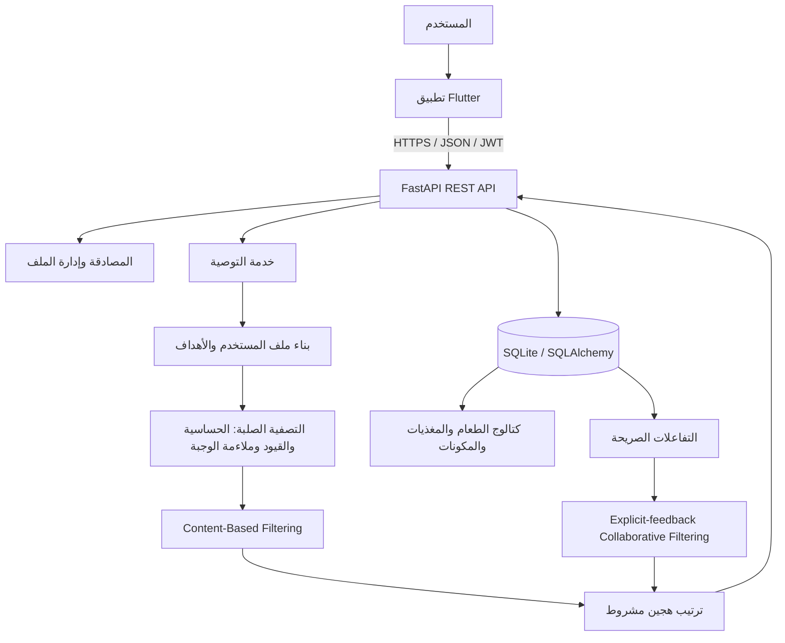

# التوثيق النظري لمشروع التخرج

## نظام ذكي وآمن لتوصية وجبات وخطط غذائية شخصية باستخدام تقنيات تعلم الآلة والتغذية الراجعة من المستخدم

**إعداد:** Hashem Teeka  
**نوع المشروع:** نظام توصية غذائية شخصي (Personalized Dietary Recommendation System)  
**المنصات:** تطبيق هاتف مبني بـFlutter، وخدمة خلفية مبنية بـFastAPI  
**لغة الوثيقة:** العربية، مع الإبقاء على المصطلحات التقنية الأساسية باللغة الإنجليزية عند الحاجة.

---

## 1. الملخص

يقدم المشروع نظامًا ذكيًا يساعد المستخدم على الوصول إلى **وجبات وخطط غذائية شخصية** اعتمادًا على خصائصه الجسمية وأهدافه الغذائية وتفضيلاته وقيوده المعلنة. يستقبل النظام بيانات مثل العمر والجنس والوزن والطول ومستوى النشاط والهدف الغذائي والحساسية وعدم الرغبة في بعض الأطعمة، ثم يحسب احتياجات غذائية تقريبية ويقترح وجبات مناسبة ضمن قاعدة بيانات غذائية موثقة.

لا يعتمد النظام على قاعدة واحدة لاختيار الطعام، بل يجمع بين **الترشيح القائم على المحتوى (Content-Based Filtering)**، وقواعد أهلية صلبة للحساسية وملاءمة الوجبة، وآلية **Collaborative Filtering** مبنية على تفاعلات صريحة يختارها المستخدم. وعندما لا تتوافر تفاعلات حقيقية كافية، يبقى النظام في وضع البدء البارد (Cold Start) ويستخدم التوصية المعتمدة على المحتوى بدل استخدام تقييمات مصطنعة. ويجعل ذلك تصميم المشروع أكثر صدقًا من الناحية العلمية، لأن النموذج لا يقدّم بيانات تجريبية على أنها تفضيلات حقيقية.

> **موقف المشروع:** النظام أداة دعم قرار غذائي واقتراح (Decision Support and Recommendation System)، وليس نظام تشخيص طبي أو بديلًا عن اختصاصي تغذية. ويجب إحالة الحالات الصحية الخاصة أو المعقدة إلى مختص مؤهل.

---

## 2. تعريف المشكلة ودافع المشروع

يواجه المستخدم العادي صعوبة في تحويل المعلومات الغذائية العامة إلى خيارات يومية عملية. فالاحتياج الغذائي يختلف بين الأفراد باختلاف العمر والكتلة والطول ومستوى الحركة والهدف، كما أن الحساسية والتفضيلات ونمط الطعام تجعل الاقتراح العام غير مناسب في كثير من الحالات. لذلك تتمثل المشكلة في بناء نظام يستطيع توليد اقتراحات قابلة للتخصيص، مع منع العناصر المخالفة للقيود قبل ترتيب الخيارات المرشحة.

يتعامل المشروع مع هذه المشكلة من خلال فصلها إلى أربع طبقات: **جمع بيانات غذائية قابلة للتتبع، بناء ملف مستخدم شخصي، تصفية آمنة للمرشحين، ثم ترتيب ذكي للبدائل المؤهلة**. يتيح هذا الفصل المحافظة على السلامة؛ إذ لا يمكن لدرجة نموذج تعلم الآلة أن تتجاوز طعامًا استبعدته قاعدة حساسية أو قيد صلب.

| العنصر | صياغته في المشروع |
|---|---|
| المدخلات | بيانات الجسم، مستوى النشاط، الهدف، أعلام صحية معلنة، الحساسية، الأطعمة غير المرغوبة، المفضلات، وسجل الوجبات والتفاعل الصريح. |
| المعالجة | حساب أهداف تقريبية، تصفية أهلية، ترتيب قائم على المحتوى، ثم مزج تعاوني مشروط بالبيانات الحقيقية. |
| المخرجات | توصيات لوجبات محددة، خطة أسبوعية، حصص مقترحة، أهداف للمغذيات، وتفسير مبسط لأساس الترتيب. |
| الحماية | عدم عرض عناصر مخالفة للحساسية أو القيود، وعدم اعتبار سجل الأكل تقييمًا تلقائيًا، وفصل التوصية عن التشخيص الطبي. |

---

## 3. أهداف المشروع

يهدف المشروع إلى بناء نظام برمجي متكامل يربط بين تحليل بيانات المستخدم والبيانات الغذائية وخوارزميات التوصية. ويتمثل الهدف الوظيفي الرئيس في اقتراح خيارات غذائية أقرب لاحتياجات المستخدم من الاقتراحات الموحدة، مع إتاحة واجهة برمجة قابلة للربط بتطبيق هاتف وواجهة توثيق تفاعلية.

| الهدف | آلية تحقيقه |
|---|---|
| التخصيص الشخصي | إنشاء ملف مستخدم يتضمن البيانات الجسمية والهدف والنشاط والتفضيلات والقيود. |
| اقتراح وجبات قابلة للتفسير | إظهار أساس الترتيب والأوزان المستخدمة في استجابة التوصية. |
| منع المخاطر المعروفة | تطبيق فلترة للحساسية وملاءمة الوجبة قبل مرحلة الترتيب. |
| إدارة بيانات غذائية موثقة | ربط الطعام بالمصدر والمغذيات والحصص والمكونات ومسببات الحساسية. |
| التعلم من التفضيلات | تسجيل إعجاب أو حفظ أو عدم إعجاب أو عدم اهتمام صريح، ثم استعماله في Collaborative Filtering عند الجاهزية. |
| قابلية التكامل | توفير REST API موثق عبر OpenAPI وSwagger، وتطبيق Flutter للمستخدم النهائي. |
| القابلية للتحقق | إضافة اختبارات وحدة وتكامل وترحيلات Alembic وقياس baseline لأداء بعض الواجهات. |

---

## 4. العنوان الأكاديمي المقترح ومدى مطابقته للمشروع

العنوان المناسب للمشروع هو:

> **نظام ذكي وآمن لتوصية وجبات وخطط غذائية شخصية باستخدام التعلم الآلي والتغذية الراجعة من المستخدم.**

يعد هذا العنوان أدق من عبارة «اقتراح أنظمة غذائية» وحدها، لأن المخرجات الفعلية للنظام تشمل اقتراح وجبات وخطط أسبوعية، وليس برنامجًا علاجيًا أو وصفة طبية. كما يوضح العنوان وجود جانب تعلم آلي حقيقي عبر Content-Based Filtering وبنية Collaborative Filtering القائمة على تفاعل المستخدمين.

| جزء العنوان | الدليل المقابل في التنفيذ |
|---|---|
| نظام ذكي | قواعد غذائية، تحليل خصائص المستخدم، ترتيب مرشحين، وقيود أمان. |
| توصية شخصية | استخدام العمر والوزن والطول والنشاط والهدف والحساسية والتفضيلات. |
| وجبات وخطط غذائية | توصيات بحسب الوجبة وخطط أسبوعية وسجل استهلاك. |
| تعلم الآلة | K-Means للتحليل التجميعي، وContent-Based Filtering، وCollaborative Filtering صريح ومشروط بالجاهزية. |
| التغذية الراجعة | `like` و`save` و`dislike` و`not_interested` تحفظ في جدول مخصص ولا تُستنتج من سجل الوجبات. |

---

## 5. نظرة عامة على المعمارية

يتبع المشروع معمارية عميل–خادم (Client–Server). يتعامل تطبيق Flutter مع المستخدم، ويستدعي REST API المكتوبة بـFastAPI. تتولى الخدمة الخلفية المصادقة والتحقق وقواعد التوصية والوصول إلى قاعدة البيانات. أما طبقة النماذج فتحتوي على منطق تحليل الملف الشخصي، والمرشحات الصلبة، والترتيب القائم على المحتوى، والتصفية التعاونية الصريحة عند توفر بيانات واقعية كافية.



تقوم FastAPI تلقائيًا بتوليد مخطط OpenAPI ووثائق Swagger UI وReDoc، مما يسهّل اختبار الواجهات وربط تطبيق الهاتف بها. وتدعم FastAPI توصيف المسارات والمعلمات والأجسام الأمنية ضمن OpenAPI، بما في ذلك واجهات توثيق تفاعلية افتراضية [1] [2].

---

## 6. التقنيات والأدوات المستخدمة

### 6.1 طبقة الخادم والبيانات

| التقنية | الاستخدام داخل المشروع | سبب الاختيار |
|---|---|---|
| Python | تنفيذ منطق البيانات والخوارزميات والخدمة الخلفية. | مناسبة لمكتبات تحليل البيانات والتعلم الآلي وسريعة التطوير. |
| FastAPI | بناء REST API، التحقق من المدخلات، المصادقة، وSwagger. | تعتمد على OpenAPI وتوفر توثيقًا واختبارًا تفاعليًا للواجهات [1]. |
| Pydantic | نماذج طلبات واستجابات API والتحقق من صحة البيانات. | تقليل أخطاء العقود بين العميل والخادم. |
| SQLAlchemy | ORM وربط كائنات Python بالجداول والعلاقات. | فصل منطق التطبيق عن تفاصيل SQL ودعم العلاقات. |
| SQLite | قاعدة بيانات خفيفة لمرحلة التطوير والعرض الأكاديمي. | سهلة التشغيل محليًا ولا تتطلب خادم قاعدة بيانات منفصلًا. |
| Alembic | ترحيلات قاعدة البيانات (Database Migrations). | توثيق تغييرات المخطط وتطبيقها أو الرجوع عنها بصورة مضبوطة. |
| JWT | مصادقة المستخدمين بعد تسجيل الدخول. | حمل هوية المستخدم داخل رمز موقّع يُرسل مع طلبات العميل. |
| SlowAPI | حماية أولية عبر تحديد معدل الطلبات (Rate Limiting). | تقليل محاولات إساءة الاستخدام لمسارات المصادقة. |

### 6.2 تحليل البيانات والتعلم الآلي

| التقنية أو المكتبة | الاستخدام |
|---|---|
| Pandas | قراءة البيانات الغذائية وتنظيفها وتحويلها إلى جداول تحليلية. |
| NumPy | العمليات العددية والمصفوفات والدرجات. |
| scikit-learn | K-Means، حساب التشابه الكوني، وأدوات التهيئة والتحليل. |
| Matplotlib وSeaborn | الرسوم الاستكشافية ورسوم تقييم النظام. |
| Requests | استدعاء واجهة USDA FoodData Central عند جمع بيانات الطعام. |
| python-dotenv | تحميل الإعدادات والمتغيرات السرية من بيئة التشغيل دون تضمينها في الشفرة. |

### 6.3 تطبيق الهاتف

| التقنية | الاستخدام |
|---|---|
| Flutter / Dart | تطبيق الهاتف والواجهة الرسومية. |
| Dio | تنفيذ طلبات HTTP وإضافة JWT تلقائيًا للطلبات المحمية. |
| Riverpod | إدارة حالة التطبيق. |
| go_router | التنقل بين الشاشات. |
| flutter_secure_storage | حفظ رمز JWT بصورة آمنة على الجهاز. |
| fl_chart | عرض مخططات مثل توزيع المغذيات. |
| Google Fonts / Cairo | دعم واجهة عربية واضحة. |

ينظم التطبيق عناصره في طبقات مثل الشاشات والنماذج والخدمات ومزودات الحالة. ويتفق هذا التوجه مع مبدأ فصل الاهتمامات (Separation of Concerns) الذي توصي به وثائق Flutter لسهولة التوسع والاختبار والصيانة [6].

---

## 7. مصدر البيانات الغذائية وخط أنابيب المعالجة

يستخدم المشروع بيانات غذائية من **USDA FoodData Central**، مع إضافة أطعمة عربية ومحلية منسقة داخل المشروع. توفر FoodData Central واجهة REST للبحث عن الأطعمة وجلب تفاصيلها الغذائية؛ وهي موجهة لمطوري التطبيقات التي تدمج بيانات المغذيات [7]. يحتفظ المشروع بمعرف المصدر الخارجي (`fdc_id`) وببيانات الطاقة والبروتين والكربوهيدرات والدهون والألياف والصوديوم ومغذيات أخرى حسب البيانات المتاحة.

> يجب عدم إدراج مفتاح USDA API في المستودع العام. يوضح الدليل الرسمي أن كشف المفتاح قد يؤدي إلى تعطيله؛ لذلك ينبغي حفظه في متغير بيئة أو مدير أسرار، وليس داخل الشفرة أو الوثائق العامة [7].

يمر خط المعالجة بمراحل متتابعة. تبدأ مرحلة الجمع باستدعاء بحث USDA لمصطلحات غذائية محددة، ثم دمج الأطعمة المحلية. وبعد ذلك تنظف البيانات وتوحّد أسماء الأعمدة وتحذف التكرار وتتحقق من القيم الأساسية. ثم تُجرى مرحلة استكشاف البيانات وبناء نماذج التحليل والتوصية والتقييم.

| المرحلة | الملف أو المكوّن الرئيسي | المخرج المتوقع |
|---|---|---|
| جمع البيانات | `02_collect_data.py` | ملف أولي للأطعمة من USDA والأطعمة المحلية. |
| التنظيف | `03_clean_data.py` | بيانات موحدة وخالية من التكرار والقيم غير المقبولة. |
| الاستكشاف | `04_explore_data.py` | مؤشرات ورسوم عن توزيع الغذاء والمغذيات. |
| تحليل المستخدم | `05_user_profiler.py` | خصائص مستخدم وأهداف تقريبية للوجبات. |
| التجميع | `06_kmeans_model.py` | مجموعات متشابهة من الأطعمة أو الأنماط. |
| توصية المحتوى | `07_cbf_model.py` | نموذج قائم على خصائص الطعام والملف الشخصي. |
| التقييم | `10_evaluate.py` | مقاييس Precision وRecall وF1 وNDCG والالتزام الغذائي. |

---

## 8. قاعدة البيانات والنموذج المفاهيمي

تطورت قاعدة البيانات من جداول أساسية للمستخدمين وسجلات الوجبات إلى كتالوج غذائي قابل للتتبع. يرفع هذا التصميم جودة المشروع لأنه يفصل بين «اسم وجبة حر» وبين «طعام موثق له مصدر ومغذيات ومكونات وحساسية».

| المجموعة | الجداول الرئيسة | الوظيفة |
|---|---|---|
| المستخدم | `users` | الملف الشخصي، الهدف، بيانات الجسم، القيود والتفضيلات. |
| سجل الاستهلاك | `meal_logs` | توثيق ما سجله المستخدم أنه تناوله، مع الحصة والمغذيات. |
| الخطط | `weekly_plans` | حفظ الخطة الأسبوعية المولدة للمستخدم. |
| مصدر الكتالوج | `catalog_sources` | توثيق مصدر البيانات وإصداره وتاريخ استيراده. |
| الأطعمة | `foods` | الأصناف أو الوصفات، المصدر، المعرف الخارجي، التصنيف، ووسوم الوجبة. |
| المغذيات | `food_nutrients` | كمية المغذي ووحدته وأساس الوزن ومستوى جودة البيانات. |
| الحصص | `food_portions` | حصص قابلة للعرض والتحويل إلى غرامات. |
| المكونات | `ingredients` و`food_ingredients` | فصل المكونات وربطها بالطعام أو الوصفة. |
| الحساسية | `allergens` و`ingredient_allergens` و`food_allergens` | توثيق وجود أو غياب أو عدم معرفة مسبب الحساسية. |
| التفاعل الصريح | `user_food_feedback` | آخر تفاعل معلن لكل زوج مستخدم–طعام. |

تحتوي الجداول على قيود نزاهة مثل المفاتيح الفريدة وفحوصات القيم. مثال ذلك منع تكرار التفاعل لنفس المستخدم والطعام، وقصر نوع الحدث على `like` أو `save` أو `dislike` أو `not_interested`. كما يجري تحويل الحدث إلى درجة صريحة: إعجاب = `1.0`، حفظ = `0.5`، وعدم إعجاب أو عدم اهتمام = `-1.0`.

---

## 9. خوارزميات ومنطق الذكاء الاصطناعي

### 9.1 بناء الملف الغذائي للمستخدم

يبني النظام ملفًا يحتوي على العمر والجنس والوزن والطول ومستوى النشاط والهدف. ويستعمله لحساب مؤشرات تقريبية مثل **مؤشر كتلة الجسم (BMI)**، ومعدل الاستقلاب الأساسي (BMR)، وإجمالي احتياج الطاقة اليومي (TDEE)، ثم توزيع هدف اليوم على الوجبات. هذه القيم تقديرية لدعم ترتيب الاقتراحات، وليست تشخيصًا أو خطة علاجية.

| المدخل | أثره في التخصيص |
|---|---|
| العمر والجنس | يدخلان ضمن الحسابات التقديرية للطاقة. |
| الوزن والطول | يستخدمان في بناء مؤشر الجسم والحاجة التقريبية للطاقة. |
| النشاط | يرفع أو يخفض تقدير الإنفاق اليومي للطاقة. |
| الهدف | يوجه السعرات نحو المحافظة أو الزيادة أو الخفض. |
| الحساسية والقيود | تمنع المرشحين المخالفين قبل الترتيب. |
| التفضيلات وعدم الرغبة | تعدل ترتيب البدائل المؤهلة دون تجاوز قواعد السلامة. |

### 9.2 K-Means للتجميع

يستخدم المشروع K-Means في مرحلة التحليل غير المراقب لتجميع عناصر متشابهة وفق السمات الغذائية. تقسم K-Means العينات إلى عدد محدد من المجموعات من خلال تقليل مجموع مربعات المسافات داخل المجموعة (Inertia)، وتستخدم مراكز تسمى Centroids [3]. يمكن الاستفادة من التجميع لفهم بنية قاعدة الأطعمة أو لتكوين شرائح غذائية مساعدة، لكنه ليس وحده مصدر قرار التوصية النهائي.

من المهم ذكر حدود K-Means في التقرير النظري: تتطلب تحديد عدد المجموعات مقدمًا، ويفترض عملها أن شكل المجموعات قريب من الشكل المحدب والمتجانس نسبيًا؛ لذلك يجب اختيار عدد المجموعات وتحليل النتائج بدل اعتبار المجموعات حقيقة غذائية مطلقة [3].

### 9.3 الترشيح القائم على المحتوى (Content-Based Filtering)

يمثل Content-Based Filtering مسار التوصية الأساسي في حالة البدء البارد. يقارن النظام خصائص الطعام مع خصائص المستخدم واحتياجات الوجبة. وتشمل خصائص الطعام السعرات والبروتين والكربوهيدرات والدهون والألياف ومجموعة الطعام والتصنيف ووسم الوجبة ومؤشر الصحة، بينما يشمل ملف المستخدم الهدف والقيود والتفضيلات.

بعد تصفية المرشحين غير المؤهلين، تُحسب درجة محتوى لكل طعام، ثم ترتب الأطعمة تنازليًا. تتميز هذه الطريقة بأنها تعمل حتى لو كان المستخدم جديدًا ولا توجد تفاعلات سابقة، لأنها تعتمد على خصائص المحتوى والملف الشخصي بدل السلوك الجماعي.

### 9.4 التشابه الكوني (Cosine Similarity)

يستخدم المشروع التشابه الكوني في أجزاء من منطق التوصية. يحسب هذا المقياس الزاوية بين متجهين، ويُعرّف على أنه حاصل الضرب النقطي المطبّع:

\[
\operatorname{cosine\_similarity}(X,Y)=\frac{X \cdot Y}{\lVert X \rVert\lVert Y \rVert}
\]

توضح وثائق scikit-learn أن هذا المقياس هو الضرب النقطي المطبّع للمتجهات [4]. في سياق المشروع، يمكن تمثيل الطعام أو المستخدم بمتجه من الخصائص، ثم الاستفادة من قرب اتجاه المتجهات لقياس مدى الملاءمة أو التشابه.

### 9.5 التصفية التعاونية الحقيقية (Explicit-Feedback Collaborative Filtering)

أضيفت بنية Collaborative Filtering حقيقية تعتمد على **تفاعلات صريحة** بدل بيانات تقييم مصطنعة. ينشئ النظام مصفوفة مستخدم–طعام (User–Item Matrix)، حيث يمثل الصف مستخدمًا والعمود طعامًا والقيمة درجة التفاعل. لا يُستنتج الإعجاب تلقائيًا من تسجيل المستخدم لوجبة؛ فسجل الوجبة يمثل الاستهلاك، بينما التفاعل الصريح يمثل التفضيل.

| الحدث | الدرجة | التفسير |
|---|---:|---|
| `like` | 1.0 | المستخدم يعلن إعجابه بالطعام. |
| `save` | 0.5 | المستخدم يرغب بحفظ الطعام أو الرجوع إليه. |
| `dislike` | -1.0 | المستخدم يعلن عدم إعجابه. |
| `not_interested` | -1.0 | المستخدم لا يرغب برؤية هذا العنصر. |

يفيد Collaborative Filtering في اقتراح عناصر أعجب بها مستخدمون ذوو أنماط تفاعل متشابهة. يوضح المرجع التعليمي من Google أن هذا النوع من التصفية يستفيد من التشابه بين المستخدمين والعناصر، بخلاف التوصية المعتمدة على خصائص المحتوى فقط [5]. في تنفيذ المشروع الحالي، تُحسب تشابهات المستخدمين من مصفوفة التفاعل باستخدام التشابه الكوني، ثم تتجمع درجات المستخدمين المشابهين لإعطاء درجات لعناصر غير مرئية للمستخدم الهدف.

### 9.6 بوابة الجاهزية ومعالجة مشكلة البدء البارد

لا يسمح المشروع للنموذج التعاوني بالتأثير في الترتيب لمجرد وجود تفاعلات قليلة. لا يتفعّل النموذج إلا عند تحقق الشروط التالية:

| شرط الجاهزية | القيمة الحالية |
|---|---:|
| الحد الأدنى لإجمالي التفاعلات الصريحة | 10 تفاعلات |
| الحد الأدنى للمستخدمين المختلفين | 3 مستخدمين |
| الحد الأدنى للأطعمة المختلفة | 3 أطعمة |
| الحد الأدنى لتفاعلات المستخدم الهدف | تفاعلان |

عند عدم تحقق هذه الشروط، تكون قيمة `ranking_basis` هي `content_based`، وتكون أوزان المزج: محتوى = `1.0` وتعاوني = `0.0`. وعند الجاهزية، يمكن الانتقال إلى `hybrid` بعد توليد درجات تعاونية حقيقية. هذا القرار يعالج مشكلة Cold Start ويحمي النظام من إعطاء مصداقية زائفة لنموذج مدرب على تفضيلات غير واقعية.

### 9.7 استخدام سجل الوجبات كإشارة ضمنية مستقبلية

يمثل `MealLog` في النسخة الحالية تسجيلًا ذاتيًا للاستهلاك، وليس تقييمًا. لذلك لا يُفعّل Collaborative Filtering من سجل الوجبات وحده، ولا يتحول تسجيل طعام إلى `like` تلقائيًا. هذا الفصل يمنع افتراض أن كل ما أكله المستخدم يفضله، أو أن غياب السجل يعني عدم اهتمامه. تؤكد أدبيات التوصية بالإشارات الضمنية أن السلوك المسجل يفتقد إدخالًا مباشرًا عن التفضيلات ويختلف في درجة الثقة؛ لذلك يعامل كمؤشر احتمالي موزون لا كتقييم صريح [8].

| نوع الإشارة | دورها الحالي أو المقترح | أولوية القرار |
|---|---|---|
| الحساسية والقيود الصلبة | استبعاد العنصر قبل الترتيب. | حاسمة. |
| `like` و`save` و`dislike` و`not_interested` | بناء CF الصريح عند تحقق الجاهزية. | أعلى دليل على التفضيل. |
| سجل الوجبات | متابعة الاستهلاك في Dashboard. | منفذ، ولا يغذي CF حاليًا. |
| تكرار الاستهلاك بموافقة المستخدم | تعزيز ضمني محدود لـCBF أو للترتيب الهجين. | تطوير مستقبلي منخفض الوزن. |
| عدم وجود سجل | لا يعامل كإشارة سلبية. | لا عقوبة. |

تبدأ خارطة التحسين بتسجيل موافقة واضحة على استخدام سجل الاستهلاك للتخصيص، ثم بناء خصائص مشتقة مثل التكرار خلال 30 يومًا وحداثة آخر تسجيل وعدد الأيام المختلفة. يختبر هذا التعزيز زمنيًا على بيانات حقيقية، ولا يدمج في النتيجة النهائية إلا إذا حسن مؤشرات الترتيب من دون زيادة خرق القيود أو تقليل التنوع. يظل التفضيل السلبي الصريح أعلى أولوية، وتبقى المرشحات الصلبة خارج أي نموذج تعلم.

### 9.8 الترتيب الهجين (Hybrid Ranking)

بعد تطبيع الدرجات، يحسب النظام درجة نهائية وفق المعادلة التالية:

\[
\text{HybridScore}=w_c \times \text{ContentScore}+w_f \times \text{CollaborativeScore}
\]

حيث يمثل \(w_c\) وزن المحتوى و\(w_f\) وزن التصفية التعاونية. لا يطبق المزج إلا بعد مرور المرشحات على القيود الصلبة. بذلك لا يمكن لدرجة تعاونية مرتفعة أن تعيد إدخال عنصر مستبعد بسبب الحساسية أو عدم ملاءمة الوجبة.

### 9.9 قواعد الوجبات والحصص

لا يرجع النظام قائمة عشوائية من الأطعمة، بل يستعمل قوالب للوجبات مبنية على مجموعات الطعام والحصص. تتضمن الوجبة الرئيسية خانات مثل مصدر بروتين ونشويات وخضروات، مع حصص مقترحة وحدود بالجرام. كما يستخدم النظام مفهوم Exchange Lists وقواعد مستوحاة من MyPlate لتكوين طبق أكثر توازنًا من قائمة عناصر منفصلة.

---

## 10. قواعد السلامة والقيود الغذائية

تبدأ عملية التوصية بمرحلة **Hard Filtering** لا بمرحلة تعلم الآلة. يتحقق النظام من توافق نوع الوجبة، ومن الحساسية المعلنة، ومن الأطعمة غير المرغوبة، ومن بعض الأعلام الصحية المعتمدة في قواعد المشروع. ثم تمر العناصر المؤهلة فقط إلى نموذج الترتيب.

| نوع القاعدة | مثال | موقع التطبيق |
|---|---|---|
| حساسية | استبعاد طعام يحتوي على رمز حساسية معلن. | قبل الترتيب. |
| عدم رغبة | استبعاد أو تقليل ترتيب تصنيفات لا يرغب بها المستخدم. | قبل أو أثناء الترتيب حسب شدة القيد. |
| ملاءمة الوجبة | منع عناصر لا توافق الفطور أو الغداء أو العشاء أو الوجبة الخفيفة. | قبل الترتيب. |
| هدف السعرات والحصص | ملاءمة حجم الحصة مع هدف الوجبة. | تكوين الوجبة أو الخطة. |
| تفضيل المستخدم | رفع درجة أطعمة أو أنماط مفضلة. | تفضيل ناعم بعد التأهل. |

> لا يعني وجود أعلام مثل السكري أو ضغط الدم أن المشروع يصدر قرارًا طبيًا. بل تُستخدم فقط كمدخلات لقواعد معلنة ومحدودة النطاق، ويجب تطويرها ومراجعتها من متخصصين قبل ادعاء ملاءمة علاجية أو سريرية.

---

## 11. واجهات API والتوثيق التفاعلي

توفر الخدمة الخلفية REST API منظمة ضمن مجموعات للمصادقة والمستخدم والتوصيات والأطعمة والصحة. يستخدم التطبيق JWT للمصادقة، وتتحقق المسارات من هوية المستخدم قبل السماح بقراءة أو تعديل سجلاته الخاصة.

| المجموعة | أمثلة على الوظائف |
|---|---|
| Health | فحص جاهزية الخدمة وقاعدة البيانات والنماذج. |
| Authentication | التسجيل وتسجيل الدخول وإصدار رمز الوصول. |
| User Profile | قراءة وتحديث ملف المستخدم والأهداف الغذائية. |
| Meal Logs | إضافة سجل وجبة وقراءته وتعديله وحذفه وعرض ملخص الاستهلاك. |
| Recommendations | اقتراح وجبة أو خطة أسبوعية وتبديل بدائل من الخطة. |
| Foods | البحث عن الأطعمة وبياناتها الغذائية. |
| Explicit Feedback | حفظ تفاعل صريح مع طعام ومعرفة جاهزية النموذج التعاوني. |

توفر الواجهة المسارات `/docs` لـSwagger UI و`/redoc` لـReDoc و`/openapi.json` لمخطط OpenAPI. وتساعد هذه الميزة فريق الواجهة الأمامية على فهم الحقول المطلوبة والاستجابات والحماية دون قراءة شفرة الخادم مباشرة [1] [2].

---

## 12. تطبيق Flutter وتجربة المستخدم

يتضمن التطبيق شاشة افتتاحية، وتسجيل دخول وتسجيلًا متعدد الخطوات، وواجهة رئيسية، وشاشات التوصيات والخطة الأسبوعية والبحث في الأطعمة والملف الشخصي. يحتفظ التطبيق برمز JWT باستخدام تخزين آمن، ويرسل الطلبات إلى FastAPI عبر Dio، ويستخدم Riverpod لإدارة حالة التطبيق.

| الشاشة | الدور |
|---|---|
| Splash | فحص وجود جلسة محفوظة وتحويل المستخدم إلى الشاشة المناسبة. |
| Login / Register | إنشاء حساب وتسجيل دخول وتجميع بيانات المستخدم الأساسية. |
| Home / Dashboard | عرض الهدف اليومي، الاستهلاك الفعلي من سجل الوجبات، المتبقي، حالة التخصيص، وإجراءات التوصية والخطة. |
| Recommendations | عرض اقتراحات الفطور والغداء والعشاء والوجبات الخفيفة. |
| Weekly Plan | عرض خطة سبعة أيام بصورة قابلة للتوسيع. |
| Food Search | البحث والتصفية في قاعدة الأطعمة. |
| Profile | عرض بيانات المستخدم ومؤشرات تقريبية وتسجيل الخروج. |

يعتمد تنظيم التطبيق على طبقات تتضمن `core` و`models` و`services` و`providers` و`screens`. ينسجم هذا التقسيم مع مبدأ فصل واجهة المستخدم عن طبقة البيانات والخدمات، وهو اتجاه يدعم قابلية الاختبار والصيانة [6]. تستخدم Dashboard مسارًا رسميًا للتقدم اليومي؛ يجمع الخادم فقط سجلات المستخدم الحالي في اليوم المطلوب ويعيد المستهلك والمتبقي والنسبة لكل مغذٍ. يؤدي زر «سجّل كوجبة مأكولة» في بطاقة التوصية إلى حفظ الحصة والمغذيات الظاهرة في السجل ثم تحديث بطاقة Dashboard، من دون تحويل هذا الإجراء إلى تفضيل صريح.

---

## 13. الاختبارات وضمان الجودة

يغطي المشروع اختبارات قاعدة البيانات والترحيلات ومنطق الترتيب والفلترة الآمنة وواجهات المستخدمين وسجل الوجبات والتفاعل الصريح وتوثيق OpenAPI. استُخدمت اختبارات وحدة (Unit Tests) لعزل دوال الترتيب والتشابه والجاهزية، كما استُخدمت اختبارات تكامل (Integration Tests) لاختبار العقود بين FastAPI وقاعدة SQLite المؤقتة.

| جانب الاختبار | ما يتم التحقق منه |
|---|---|
| Alembic | إنشاء المخطط، ترقيته، والبحث عن تغييرات غير مُرحّلة. |
| فلترة الحساسية | استبعاد العناصر ذات الحساسية المعلنة قبل الترتيب. |
| سياسة الترتيب | بقاء النظام على Content-Based عند نقص التفاعل. |
| Collaborative Filtering | التفعيل بعد الجاهزية، وتقييم العناصر غير المرئية فقط. |
| API للمستخدم | ملكية المستخدم لسجل الوجبة وإضافة وتحديث وحذف السجلات. |
| API للتفاعل الصريح | حفظ وتحديث التفاعل، ورفض الطعام غير الموجود، وإظهار cold start. |
| OpenAPI | ظهور المسارات والعلامات في مخطط Swagger. |

أظهرت آخر مجموعة تحقق محلية **59 اختبارًا ناجحًا**، مع نجاح ترقية Alembic وعدم وجود تغييرات مخطط غير مُرحّلة. وتشمل النتيجة اختبارات التوصية، والتفاعل الصريح، وواجهة API، والتنوع الغذائي باستخدام K-Means، وتفسير التوصية، وتسجيل التفاعل عبر `fdc_id`، وتتبع الاستهلاك اليومي من سجل الوجبات مع استبعاد الأيام والمستخدمين الآخرين، وثبات توصيات CF والتفضيل السلبي والتقييم المكرر، وحالات الحافة لمدخلات ملف المستخدم والمصادقة والحساسيات المتعددة، وقيود قاعدة البيانات المباشرة. وهذه النتيجة تدعم سلامة السلوك البرمجي، لكنها لا تمثل في حد ذاتها دقة غذائية سريرية أو فعالية صحية للمستخدمين.

---

## 14. تقييم التوصيات والأداء

### 14.1 مقاييس جودة التوصية

يحتوي المشروع على مكوّن تقييم يستخدم مقاييس شائعة في أنظمة التوصية:

| المقياس | المعنى |
|---|---|
| Precision@K | نسبة العناصر المناسبة ضمن أول K توصيات. |
| Recall@K | نسبة العناصر المناسبة التي استطاع النظام استرجاعها من المجموعة المرجعية. |
| F1-Score | متوسط توافقي بين Precision وRecall. |
| NDCG@K | يقيس جودة ترتيب العناصر عبر إعطاء أهمية أكبر للنتائج الصحيحة في أعلى القائمة. |
| Calorie Accuracy | مدى قرب سعرات الخطة أو الوجبة من الهدف المحسوب. |
| Health Compliance Rate | نسبة التوصيات التي تلتزم بالقواعد الصحية والقيود المعرفة في النظام. |

يجب تفسير أي نتائج حالية بحذر: يمكن لقياس يستعمل قواعد المشروع نفسها لتحديد «العنصر المناسب» أن يثبت الاتساق الداخلي، لكنه لا يثبت تلقائيًا رضا المستخدم أو فعالية صحية حقيقية. لذلك ينبغي مستقبلاً إضافة تقييم بمستخدمين حقيقيين، وتغذية راجعة صريحة، ومقارنة مع baseline واضح.

### 14.2 قياس أداء واجهات API

أجري قياس محلي باستخدام FastAPI TestClient وSQLite مؤقتة، بخمس طلبات تسخين و50 طلبًا متسلسلًا لكل endpoint. لا يشمل القياس الشبكة أو TLS أو قاعدة بيانات خارجية أو التحقق الكامل من JWT أو زمن تحميل/استدلال نموذج تعلم الآلة.

| endpoint | المتوسط المحلي | P95 المحلي |
|---|---:|---:|
| `GET /users/profile` | 1.773 ms | 2.254 ms |
| `GET /users/meal-logs` | 3.134 ms | 4.251 ms |
| `GET /users/meal-logs/summary` | 3.739 ms | 5.671 ms |
| `POST /users/meal-logs` | 6.431 ms | 8.469 ms |
| `POST /users/food-feedback` | 5.398 ms | 6.866 ms |
| `GET /users/food-feedback/readiness` | 3.063 ms | 3.910 ms |

هذه النتائج تشكل baseline للتطوير فقط، وليست اتفاقية مستوى خدمة (SLA). عند النشر، يجب تنفيذ اختبار حمل متزامن باستخدام بيئة staging وقاعدة بيانات قريبة من الإنتاج، ثم فصل زمن الاستجابة إلى زمن API وزمن قاعدة البيانات وزمن محرك التوصية.

---

## 15. نقاط القوة الحالية

| نقطة القوة | قيمتها للمشروع |
|---|---|
| فصل القيود عن الترتيب | يمنع تجاوز الحساسية أو القواعد الصلبة بسبب درجة نموذج تعلم آلي. |
| Cold Start واضح | يعمل النظام بمحتوى وملف المستخدم عند غياب تفاعلات المستخدمين. |
| CF صريح بدل المصطنع | لا يقدم تفضيلات مصطنعة على أنها بيانات حقيقية. |
| قاعدة بيانات قابلة للتتبع | تسجل مصادر الطعام والمغذيات والمكونات والحساسية. |
| ترحيلات قاعدة بيانات | تجعل تغيير المخطط قابلاً للمراجعة وإعادة الإنتاج. |
| API موثق | يسرع الربط بين Flutter والخادم ويقلل أخطاء التكامل. |
| اختبارات آلية | تدعم اكتشاف الانحدار البرمجي عند تعديل الخوارزميات أو الجداول. |
| دعم أطعمة محلية | يرفع ملاءمة المشروع للسياق العربي والشرق أوسطي. |

---

## 16. القيود الحالية والاعتبارات الأخلاقية

رغم وجود بنية قوية للمشروع، توجد حدود يجب عرضها بصراحة في التقرير والمناقشة. أولًا، الأهداف الغذائية المحسوبة تقريبية وتعتمد على معادلات ومدخلات يصرح بها المستخدم. ثانيًا، ليست كل بيانات الأطعمة أو المكونات أو مسببات الحساسية مكتملة؛ لذلك يعتمد النظام على ما هو موثق في الكتالوج ولا ينبغي أن يفترض السلامة عند غياب المعلومة. ثالثًا، لا يصبح Collaborative Filtering مفيدًا إلا بعد جمع تفاعل حقيقي من عدد مناسب من المستخدمين.

| القيد | أثره | التخفيف المقترح |
|---|---|---|
| نقص التفاعلات في البداية | بقاء CF غير فعال لمستخدم جديد. | الاعتماد على CBF، وطلب تفضيلات اختيارية عند التسجيل. |
| جودة مصدر الطعام | قد تختلف القيم حسب المصدر أو الوصفة أو الحصة. | توثيق المصدر والإصدار والجودة وتاريخ الاستيراد. |
| الحساسية غير الموثقة | لا يمكن للنظام ضمان سلامة عنصر بلا بيانات مكونات وحساسية كافية. | عرض تنبيه واضح واعتماد مصادر موثقة ومراجعة مختص. |
| الحالات الطبية المعقدة | القواعد العامة لا تكفي لتقديم قرار علاجي. | عدم تقديم تشخيص أو علاج وإحالة المستخدم لمختص. |
| الخصوصية | الملف الشخصي وسلوك التفضيل بيانات حساسة. | أقل قدر من البيانات، JWT، عدم نشر الأسرار، وتحديد صلاحيات الوصول. |
| SQLite في الإنتاج | قد لا يناسب تعدد المستخدمين والحمل المرتفع. | الانتقال إلى PostgreSQL مع نسخ احتياطي ومراقبة. |

---

## 17. التطوير المستقبلي المقترح

يمكن تطوير المشروع تدريجيًا دون تغيير الفكرة الأساسية. تبدأ الأولوية بجمع تفاعلات حقيقية واضحة من المستخدمين، ثم مقارنة CBF وCF وHybrid على بيانات holdout. وبعد توافر حجم بيانات كاف، يمكن الانتقال من user-based cosine similarity إلى Matrix Factorization أو نموذج Neural Collaborative Filtering، مع الحفاظ على المرشحات الصلبة خارج النموذج.

| الأولوية | التطوير المقترح | القيمة المتوقعة |
|---|---|---|
| 1 | استيراد كتالوج طعام موثق بشكل دوري مع نسخ للمصدر والإصدار. | جودة أعلى وقابلية تتبع أفضل. |
| 2 | إضافة واجهة Flutter لتسجيل التفاعلات الصريحة وعرض سبب التوصية. | جمع بيانات حقيقية وزيادة الشفافية. |
| 3 | بناء لوحة مراقبة للبيانات والتفاعل والالتزام بالقيود. | قياس جودة الاستخدام وتحديد فجوات البيانات. |
| 4 | اختبار A/B بين CBF وHybrid عند الجاهزية. | قياس أثر CF على رضا المستخدم ومقاييس الترتيب. |
| 5 | استخدام PostgreSQL وRedis وخدمات منفصلة عند التوسع. | تحسين الأداء والتزامن والاعتمادية. |
| 6 | مراجعة القواعد الغذائية من اختصاصي تغذية. | رفع سلامة القواعد ووضوح حدود الاستخدام. |
| 7 | إضافة Matrix Factorization أو Deep Learning بعد توافر بيانات كافية ومصرح بها. | التقاط أنماط تفضيل معقدة وتحسين التخصيص. |

---

## 18. الخلاصة

يمثل المشروع نظامًا متكاملًا لتوصية وجبات وخطط غذائية شخصية، يجمع بين التطبيق المحمول والخدمة الخلفية وقاعدة بيانات منظمة وخوارزميات تعلم آلي وقواعد أمان. يعتمد النظام على Content-Based Filtering كحل عملي للبدء البارد، ويحتوي على بنية Collaborative Filtering حقيقية تعتمد على تفاعلات صريحة بدل البيانات المصطنعة. كما يفصل بوضوح بين الاستهلاك والتفضيل، وبين التصفية الآمنة والترتيب الذكي.

وعليه، فإن المشروع يطابق عنوان **«نظام ذكي لتوصية وجبات وخطط غذائية شخصية باستخدام تعلم الآلة»**، بشرط عرض حدوده بوضوح وعدم تقديمه كبديل عن الرعاية الطبية. وتكمن قوته الأكاديمية في الجمع بين قابلية التنفيذ البرمجي، والشفافية، وقابلية القياس، وخطة واقعية لتحسين الدقة عند تراكم تفاعل حقيقي من المستخدمين.

---

## الجزء الثاني: التوثيق العملي والتنفيذ

### 19. نطاق التنفيذ وحالة المكونات

يوثق هذا القسم ما نُفذ برمجيًا في المستودع حتى مرحلة إعداد هذه الوثيقة. يقسم التنفيذ إلى طبقات مستقلة كي يسهل اختبار كل طبقة وتطويرها. لا يعني وجود جميع هذه الطبقات أن النظام أصبح منتجًا طبيًا؛ بل يعرض نظامًا أكاديميًا متكاملًا لتوصية الوجبات قائمًا على كتالوج طعام، وملف مستخدم، وقواعد أمان، وخوارزميات توصية قابلة للشرح.

| المكوّن | الحالة | التفاصيل العملية |
|---|---|---|
| تطبيق الهاتف Flutter | منفذ | شاشات المصادقة، الملف الشخصي، التوصيات، الخطة الأسبوعية، البحث، وسجل الوجبات. |
| خدمة FastAPI | منفذ | مسارات مصادقة ومستخدمين ووجبات وتوصيات وأطعمة وتفاعل صريح، مع Swagger. |
| ترحيلات البيانات Alembic | منفذة | تهيئة مخطط قاعدة البيانات، كتالوج الطعام، التتبع والحساسية، والتفاعل الصريح. |
| Content-Based Filtering | منفذ ويعمل في البدء البارد | المسار الافتراضي عند عدم توافر تفضيلات صريحة كافية. |
| Explicit Collaborative Filtering | منفذ ومشروط بالجاهزية | لا يدخل في الترتيب إلا بعد تفاعل صريح حقيقي يحقق بوابة الجاهزية. |
| تنويع K-Means وتفسير التوصية | منفذ في فرع Pull Request | تنويع ناعم للخطة وإرجاع سبب ومجموعة غذائية لكل عنصر. |
| نموذج طبي أو علاجي | خارج النطاق | لا يقدم تشخيصًا ولا نظامًا علاجيًا ولا بديلًا عن مختص. |

### 20. تنظيم المستودع والملفات البرمجية

يقسم المستودع المسؤوليات بين مراحل إعداد البيانات، والنماذج، والخدمة الخلفية، وتطبيق الهاتف. هذا التقسيم مهم في الجزء العملي لأنه يبيّن أن منطق التوصية غير مدمج داخل واجهة المستخدم، وأن اختبار الخوارزمية ممكن من دون تشغيل التطبيق كاملًا.

| المسار أو الملف | المسؤولية |
|---|---|
| `02_collect_data.py` | جمع بيانات الأطعمة من المصدر الخارجي وإضافة البيانات المحلية. |
| `03_clean_data.py` | تنظيف الحقول وتوحيدها والتعامل مع التكرار والقيم الناقصة. |
| `05_user_profiler.py` | تكوين ملف المستخدم وحساب مؤشرات واحتياجات تقريبية. |
| `06_kmeans_model.py` | الاستكشاف والتجميع التحليلي الأولي للبيانات. |
| `07_cbf_model.py` | تدريب وتحميل نموذج التوصية المعتمد على المحتوى. |
| `09_hybrid_recommender.py` | ترتيب المرشحين وبناء الوجبات والخطة الأسبوعية ودمج التنوع. |
| `meal_rules.py` | قوالب الوجبات، التصفية الصلبة، والحصص. |
| `recommender_engine.py` | واجهة موحدة لمحرك التوصية، والبدائل، والاستبدال داخل الخطة. |
| `api/services/recommendation_policy.py` | دوال ترتيب نقية وقابلة للاختبار، تشمل المزج والتجميع والتنوع والتفسير. |
| `api/routes/` | تعريف مسارات FastAPI وتنفيذ عقود API. |
| `api/db_models.py` | نماذج SQLAlchemy للجداول والعلاقات. |
| `api/migrations/` | ملفات Alembic الإصدارية لترحيل مخطط قاعدة البيانات. |
| `api/tests/` | اختبارات الوحدة والتكامل والعقود. |
| `app/` | تطبيق Flutter، الشاشات والخدمات والنماذج ومزودات الحالة. |
| `docs/` | توثيق Swagger والتوصية المتنوعة والوثائق الأكاديمية. |

### 21. إعداد بيئة التشغيل

يعتمد التنفيذ المحلي على Python وبيئة افتراضية، ثم تثبيت تبعيات الخادم واختبارات التطوير. يجب إنشاء ملف بيئة محلي فقط، وعدم رفعه إلى GitHub؛ لأن إعدادات قاعدة البيانات ومفاتيح JWT وواجهة USDA يجب أن تأتي من متغيرات البيئة. يعرض المثال التالي أوامر تشغيل مرجعية، وتعدل بحسب نظام التشغيل واسم البيئة الافتراضية.

```bash
python -m venv .venv
source .venv/bin/activate
pip install -r requirements-deploy.txt
pip install -r requirements-dev.txt
alembic upgrade head
uvicorn api.main:app --reload
```

بعد التشغيل، تكون واجهة التوثيق التفاعلية متاحة عادةً على `/docs`، وتكون وثيقة OpenAPI الخام متاحة على `/openapi.json`. يجب تنفيذ `alembic upgrade head` قبل تشغيل الخادم في أي بيئة جديدة حتى لا يعتمد التطبيق على إنشاء الجداول أو تعديلها تلقائيًا.

### 22. التنفيذ العملي لقاعدة البيانات

#### 22.1 ترحيلات Alembic

استخدم المشروع Alembic لاستبدال نمط `create_all()` أو أي تعديل صامت للمخطط عند بدء الخادم. كل تغيير بنيوي يمر عبر ملف ترحيل ذي رقم إصدار، وبذلك يستطيع المطور إنشاء قاعدة نظيفة، أو رفع قاعدة قديمة إلى آخر إصدار، أو التحقق من أن النماذج لا تحتوي تغيرات غير مضافة إلى ترحيل.

| الترحيل | الأثر العملي |
|---|---|
| الترحيل الأولي | إنشاء المستخدمين وسجل الوجبات والخطط والجداول الأساسية. |
| كتالوج الطعام والتتبع | إضافة المصادر والأطعمة والمغذيات والحصص والمكونات ومسببات الحساسية. |
| التفاعل الصريح | إضافة جدول `user_food_feedback` وفهارس الجاهزية للتصفية التعاونية. |

يستخدم فريق المشروع الأوامر التالية للتحقق من سلامة المخطط:

```bash
alembic upgrade head
alembic check
pytest api/tests/test_database_migrations.py -q
```

#### 22.2 التفاعل الصريح مع الطعام

يفصل التصميم بين سجل ما تناوله المستخدم وبين ما يفضله. يحفظ جدول `user_food_feedback` حدثًا واحدًا محدثًا لكل زوج مستخدم–طعام؛ وتمنع علاقة فريدة تكرار السجل لنفس المستخدم والطعام. هذا القرار مهم لأن اعتبار الطعام المسجل وجبةً تقييمًا إيجابيًا يمثل تسربًا دلاليًا؛ فقد يأكل المستخدم طعامًا لأنه المتاح لا لأنه يفضله.

| الحقل | الاستخدام في التنفيذ |
|---|---|
| `user_id` | يربط التفاعل بصاحب الحساب. |
| `food_id` | يربط التفاعل بصنف موثق من كتالوج الطعام. |
| `event_type` | نوع الإشارة الصريحة مثل إعجاب أو حفظ أو عدم إعجاب. |
| `value` | تحويل الحدث إلى قيمة عددية تستخدم في مصفوفة المستخدم–العنصر. |
| `created_at` و`updated_at` | التتبع الزمني والمراجعة عند تحديث التفاعل. |

### 23. التنفيذ العملي لمسار التوصية

#### 23.1 بناء الملف والأهداف التقريبية

عند طلب توصية، تبني الخدمة كائن ملف مستخدم من بيانات الحساب والقيود والتفضيلات. يحسب هذا الكائن أهدافًا تقريبية للطاقة والمغذيات وتوزيعها على الوجبات. لا يعتبر هذا الحساب نموذج تعلم آلي مدربًا، بل طبقة حسابية حتمية تستخدم لتكوين سياق التوصية وتحديد حجم الحصص التقريبي.

#### 23.2 التصفية الصلبة قبل الترتيب

تعمل `meal_rules.py` قبل أي ترتيب. تستبعد هذه الطبقة العناصر غير المطابقة لوسم الوجبة، والعناصر التي تحتوي على حساسية معلنة أو تقع ضمن عدم الرغبة أو قيود النظام. لا يسمح للـContent-Based Filtering أو للتصفية التعاونية أو لتنوع K-Means بإعادة عنصر أزيل في هذه المرحلة.

```text
كل الأطعمة المرشحة
    → مطابقة نوع الوجبة
    → استبعاد الحساسية والقيود الصلبة
    → استبعاد العناصر غير المرغوبة
    → ترتيب المرشحين المؤهلين فقط
```

#### 23.3 Content-Based Filtering

يشكل Content-Based Filtering مسار البدء البارد. يستخدم خصائص الطعام مثل السعرات والمغذيات والألياف ومجموعة الطعام ونوع الوجبة، ثم يقارنها مع سياق المستخدم وهدف الوجبة. يعيد النموذج درجة أولية تسمى `cbf_score`، ثم تتحول داخل المحرك إلى `raw_cbf` وتطبع قبل أن تدخل في `hybrid_score`.

هذا المسار هو السبب في أن مستخدمًا جديدًا يحصل على توصيات مباشرة حتى من دون سجل تفاعل، وهو مناسب لنطاق مشروع التخرج الحالي الذي لا يملك Dataset كبيرة من تفضيلات مستخدمين حقيقيين.

#### 23.4 التصفية التعاونية الصريحة والبوابة

عند وجود التفاعلات الصريحة، يحول النظام آخر أحداث المستخدمين إلى مصفوفة مستخدم–طعام. يحسب نموذج `ExplicitFeedbackCollaborativeFilter` درجات لعناصر لم يرها المستخدم فقط. قبل إعادة أي درجة تعاونية، تفحص الخدمة أربعة شروط: عدد التفاعلات، وعدد المستخدمين، وعدد العناصر، وعدد تفاعلات المستخدم نفسه. فإذا لم تتحقق الشروط، يبقى وزن المحتوى `1.0` ووزن CF `0.0`.

```text
تفاعل صريح حقيقي
    → جدول user_food_feedback
    → مصفوفة User–Item
    → قياس تشابه المستخدمين
    → درجات لعناصر غير مرئية
    → تفعيل Hybrid Ranking عند تجاوز بوابة الجاهزية
```

#### 23.5 الترتيب الهجين

تطبع الدرجات لضمان مجال موحد، ثم يحسب المحرك الدرجة النهائية. في الوضع الافتراضي تكون النتيجة مساوية لترتيب المحتوى. وعند توفر تفاعل صريح كاف، يستخدم النظام مجموعًا موزونًا بين درجة المحتوى ودرجة التفاعل التعاوني.

```python
hybrid_score = content_weight * cbf_norm + collaborative_weight * cf_norm
```

لا تستعمل الدالة درجات تعاونية مصطنعة أو بيانات `meal_logs` بوصفها تفضيلًا. هذا قيد تنفيذي اختُبر صراحةً ضمن اختبارات السياسة.

### 24. دمج K-Means لتنوع الوجبات

#### 24.1 الهدف العملي

لا يستخدم K-Means لتحديد ما إذا كان الطعام صحيًا أو مناسبًا طبيًا. يهدف فقط إلى تقليل تكرار أطعمة متشابهة غذائيًا داخل الخطة الأسبوعية. بعد أن تمر قائمة الأطعمة بالقيود الصلبة وترتيب المحتوى، ينظر النظام إلى مجموعة المغذيات التي ينتمي إليها كل مرشح ويُفضل البديل الأعلى درجة من مجموعة لم تستخدم مؤخرًا ضمن مجموعة الطعام نفسها.

#### 24.2 ميزات التجميع والإعداد الحالي

يحضر المحرك متجهًا غذائيًا لكل طعام من الحقول `calories` و`protein` و`carbs` و`fat` و`fiber` و`sugar` و`sodium`. تطبق `StandardScaler` أولًا لأن القيم تقاس بوحدات ومجالات مختلفة، ثم تنفذ `KMeans` بقيمة `random_state=42` و`n_init=20` لضمان إمكانية إعادة النتيجة. الإعداد الحالي يستخدم ست مجموعات كقيمة مبدئية قابلة للتغيير بعد الاختبار العلمي.

| العنصر | التنفيذ الحالي |
|---|---|
| دالة بناء المجموعات | `build_food_cluster_map()` في `api/services/recommendation_policy.py`. |
| المدخل | كتالوج الأطعمة الذي يحمله نموذج المحتوى. |
| المخرج | خريطة `fdc_id → food_cluster` داخل الذاكرة. |
| الاستخدام | اختيار مرشح من مجموعة غير مستخدمة حديثًا عندما يوجد بديل مؤهل. |
| fallback | العودة إلى أعلى `hybrid_score` عندما لا تتوفر مجموعة جديدة. |
| نطاق الذاكرة | آخر مجموعتين فقط لكل مجموعة طعام لتجنب تقييد التنوع بصورة مبالغ فيها. |

#### 24.3 خوارزمية الاختيار المتنوع

تظهر الخوارزمية التالية منطق التنفيذ بصورة مبسطة. النقطة الجوهرية هي أن التنوع **تفضيل ناعم** لا فلتر صلب؛ لذلك يبقى النظام قادرًا على اقتراح أفضل بديل عندما تكون قائمة الطعام ضيقة.

```python
eligible = apply_hard_filters(candidates, user, meal)
ranked = rank_by_content_or_safe_hybrid(eligible, user)
recent = recent_clusters_by_food_group[current_food_group]
fresh = ranked[~ranked.food_cluster.isin(recent)]
selected = fresh.iloc[0] if not fresh.empty else ranked.iloc[0]
diversity_applied = selected.food_id != ranked.iloc[0].food_id
```

#### 24.4 اختيار العدد الأمثل للمجموعات

لا ينبغي اعتبار `K=6` نتيجة نهائية قبل اختبارها. يختبر المشروع قيم `K` من 2 إلى 12 على كتالوج الأطعمة المنظف، ثم يقارن Inertia وSilhouette Score وCalinski–Harabasz وDavies–Bouldin، ويفحص ثبات التجميع عبر نقاط بداية متعددة. بعدها يولد خططًا أسبوعية لكل قيمة مرشحة ويقارن تنوعها دون أي خرق للقيود.

| المؤشر | اتجاه التفضيل | سبب استخدامه |
|---|---|---|
| Inertia | أقل مع وجود نقطة انعطاف | تقدير تماسك العناصر داخل المجموعة، ولا يكفي منفردًا. |
| Silhouette Score | أعلى | يوازن التماسك داخل المجموعة والانفصال عن المجموعات الأخرى. |
| Calinski–Harabasz | أعلى | قياس إضافي لنسبة التباين بين المجموعات وداخلها. |
| Davies–Bouldin | أقل | يلتقط تقارب المجموعات أو تداخلها. |
| ARI عبر Seeds متعددة | أعلى | يختبر استقرار النتيجة عندما تتغير نقطة البدء. |
| تنوع الخطة | أعلى مع خرق قيود = 0% | يربط جودة التجميع بهدف النظام الفعلي. |

#### 24.5 مخرجات التفسير

يرجع المحرك مع كل عنصر `food_cluster` و`recommendation_reasons` و`recommendation_reason` و`diversity_applied`. يجمع السبب بين هدف المستخدم المعلن، وقالب الوجبة، وإشارة تنوع أو فلتر غذائي موثق في الكتالوج. لا تستخدم هذه النصوص لغة تشخيصية أو علاجية.

| الحقل | مثال استعمال في الواجهة |
|---|---|
| `recommendation_reason` | «مناسب لهدف المحافظة ... ويتوافق مع قالب الغداء ...». |
| `recommendation_reasons` | عرض الأسباب كبطاقات أو نقاط قصيرة داخل Flutter. |
| `food_cluster` | بيانات تقنية يمكن إخفاؤها عن المستخدم أو عرضها في وضع المطور. |
| `diversity_applied` | شارة «اختيار متنوع» عندما اختير بديل من مجموعة غذائية جديدة. |

### 25. التنفيذ العملي لواجهات API

تستخدم جميع المسارات JSON. تتطلب المسارات المحمية رمز JWT في ترويسة `Authorization: Bearer <token>`. ينصح بعرض أمثلة حقيقية من Swagger أو من Postman في التقرير العملي، مع إزالة أي رمز وصول قبل تصوير الشاشة.

| المجموعة | المسار أو النمط | الغرض |
|---|---|---|
| توصية وجبة | `POST /recommendations/meal` | إرجاع أفضل عناصر لوجبة محددة، مع الدرجة والتفسير. |
| خطة أسبوعية | `GET` أو `POST /recommendations/weekly` | جلب خطة محفوظة أو توليد خطة جديدة. |
| بدائل واستبدال | `POST /recommendations/weekly/alternatives` و`/weekly/swap` | اقتراح بدائل مؤهلة وحفظ اختيار المستخدم. |
| سجل الوجبات | `/users/meal-logs` | إضافة وقراءة وتعديل وحذف سجل الاستهلاك وملخص المغذيات. |
| التفاعل الصريح | `/users/food-feedback` | حفظ إعجاب أو حفظ أو عدم إعجاب أو عدم اهتمام. |
| جاهزية CF | `/users/food-feedback/readiness` | إظهار ما إذا كانت بيانات التفاعل تكفي لتفعيل الترتيب التعاوني. |
| توثيق API | `/docs` و`/redoc` و`/openapi.json` | اكتشاف العقود وتجربة المسارات التفاعلية. |

يتضمن عقد عنصر التوصية معلومات الطعام والحصة والمغذيات و`hybrid_score`، إلى جانب حقول التنوع والتفسير. لا يجب أن تعتمد واجهة Flutter على ترتيب الحقول النصي؛ بل تستخدم أسماء الحقول الموثقة في OpenAPI.

### 26. ربط Flutter بالخادم

تتصل واجهة Flutter بالخدمة من خلال طبقة `Dio`. يحمل التطبيق رمز JWT من `flutter_secure_storage` ويضيفه إلى طلبات المستخدم المحمية. تنظم Riverpod الحالة بين الشاشات لتجنب تكرار استدعاءات API وإتاحة إعادة بناء الواجهة عند تغير ملف المستخدم أو الخطة.

| التفاعل في الواجهة | طلب API المرتبط | النتيجة المعروضة |
|---|---|---|
| إكمال الملف الشخصي | تحديث بيانات المستخدم | أهداف تقريبية وملف محفوظ. |
| فتح شاشة التوصيات | `POST /recommendations/meal` | بطاقات طعام وحصص وأسباب. |
| فتح الخطة الأسبوعية | `GET /recommendations/weekly` | وجبات مرتبة بحسب الأيام والخانات. |
| طلب خطة جديدة | `POST /recommendations/weekly` | خطة جديدة محفوظة للمستخدم. |
| اختيار بديل | alternatives ثم swap | استبدال داخل الخطة وحفظ التعديل. |
| ضغط إعجاب أو عدم إعجاب | `POST /users/food-feedback` | تسجيل تفضيل صريح وتحديث حالة الجاهزية. |

يستحسن في التوثيق العملي إرفاق لقطات لشاشة تسجيل المستخدم، وتوصية وجبة مع السبب، وخطة أسبوعية، وSwagger، وقاعدة البيانات بعد تطبيق الترحيلات. هذه اللقطات تثبت الترابط بين طبقة العميل والخادم وقاعدة البيانات.

### 27. الاختبارات المنفذة وآلية التشغيل

تقسم الاختبارات إلى اختبارات وحدة لعزل دوال المنطق، واختبارات تكامل لتشغيل FastAPI مع SQLite مؤقتة، واختبارات ترحيل لضمان صلاحية قاعدة بيانات جديدة. عند آخر تحقق، اجتازت المجموعة الكاملة 59 اختبارًا، بعد إضافة اختبارات القيم السالبة والصفرية والعمر المفرط، والتحديث الجزئي غير المتسق للوزن والطول، وJWT المفقود أو المنتهي، والحساسيات المتعددة مع بيانات ناقصة، وقيود قاعدة البيانات المباشرة، والتفاعل عبر `fdc_id` القادم من تطبيق الهاتف، وملخص التقدم اليومي الذي يعزل سجلات اليوم والمستخدم الحالي فقط، وثبات CF وعدم تسريب العناصر المقيمة ورفض الدعم التعاوني السلبي. قد يتغير العدد عند إضافة اختبارات لاحقة؛ لذلك يوثق الرقم مع commit أو Pull Request المستخدم في التقرير النهائي.

| ملف الاختبار أو النوع | الحالات المتحققة |
|---|---|
| `test_database_migrations.py` | ترقية المخطط والرجوع والتحقق من رفض المخطط غير المدار، ورفض إدخال SQL مباشر يخالف قيود ملف المستخدم. |
| `test_food_catalog_migrations.py` | إنشاء الكتالوج والعلاقات والقيود وجودة بيانات المغذيات. |
| `test_recommendation_policy.py` | أوزان CBF وCF، منع CF عند عدم الجاهزية، وتطبيع الدرجات. |
| `test_meal_rules.py` | تطبيق حساسية موثقة قبل ترتيب المرشحين. |
| `test_feedback_collaborative_filter.py` | cold start، تقييم العناصر غير المرئية من تفاعل صريح فقط، ثبات التوصية، الإشارات السلبية، وتكرار التفاعل. |
| `test_food_diversity_policy.py` | ثبات K-Means، اختيار مجموعة جديدة، fallback، وسبب التوصية. |
| `test_recommendation_api.py` | عقد endpoint التوصية وحقول التنوع والتفسير. |
| `test_user_meal_log_api.py` | ملكية السجل وCRUD وملخص المغذيات. |
| `test_api_security_edge_cases.py` | رفض القيم الصفرية والسالبة والعمر المفرط، والتحديث الجزئي غير المتسق للوزن والطول، ورفض JWT المفقود أو المنتهي، وبقاء البيانات الصحيحة دون تعديل. |
| `test_openapi_docs.py` | ظهور المسارات والعلامات في OpenAPI وSwagger. |

تنفذ مجموعة الاختبارات والأوامر الأساسية كما يلي:

```bash
pytest api/tests -q
alembic upgrade head
alembic check
```

نفذ أيضًا اختبار دخان لمحرك التوصية على الكتالوج الحقيقي بعد تحميل نموذج المحتوى. في آخر تحقق، ولدت خطة من يومين تضم 24 عنصرًا، وظهرت المجموعات الست في المخرجات، وطُبق التنوع على ستة اختيارات. كما أضيف تقييم قابل لإعادة التشغيل لكتالوج الأطعمة كاملًا عبر `scripts/evaluate_food_clusters.py`؛ اختبر K من 2 إلى 12 باستخدام Elbow وSilhouette وCalinski–Harabasz وDavies–Bouldin واستقرار ARI، وحفظ الرسوم والنتائج في `reports/kmeans_cluster_evaluation_*`. هذا يثبت أن اختيار التجميع موثق وقابل للمراجعة، لكنه ليس اختبارًا لفعالية صحية أو لرضا مستخدمين حقيقيين.

### 28. قياس الأداء العملي

أجري قياس baseline محلي باستخدام `FastAPI TestClient` وSQLite مؤقتة وخمس طلبات تسخين و50 طلبًا متسلسلًا لكل endpoint. لا يساوي هذا اختبار حمل في بيئة إنتاج، لكنه يعطي مرجعًا أوليًا لأي تحسين لاحق في قاعدة البيانات أو API.

| Endpoint | المتوسط المحلي | P95 المحلي | ملاحظة |
|---|---:|---:|---|
| `GET /users/profile` | 1.773 ms | 2.254 ms | قراءة ملف بسيط. |
| `GET /users/meal-logs` | 3.134 ms | 4.251 ms | قراءة سجلات المستخدم. |
| `GET /users/meal-logs/summary` | 3.739 ms | 5.671 ms | تجميع مغذيات السجل. |
| `POST /users/meal-logs` | 6.431 ms | 8.469 ms | إدخال سجل جديد. |
| `POST /users/food-feedback` | 5.398 ms | 6.866 ms | حفظ تفاعل صريح أو تحديثه. |
| `GET /users/food-feedback/readiness` | 3.063 ms | 3.910 ms | فحص بوابة CF. |

ينبغي ذكر حدود القياس في التقرير: لا يتضمن شبكة فعلية، أو HTTPS، أو قاعدة PostgreSQL خارجية، أو زمن التحقق الكامل من JWT، أو حمل مستخدمين متزامنين. عند النشر، يستخدم اختبار حمل منفصل ويقاس زمن محرك التوصية وقاعدة البيانات وطبقة API كل على حدة.

### 29. التحقق من الأمن والخصوصية

يحمل الملف الشخصي للمستخدم بيانات حساسة نسبيًا مثل العمر والوزن والطول والتفضيلات. لذلك يستخدم المشروع مبدأ أقل قدر ضروري من البيانات، ويمنع الوصول إلى سجل مستخدم من حساب آخر بواسطة الاعتماد على هوية JWT والاستعلام المقيد بمعرف المستخدم. يجب عدم تخزين كلمات المرور كنص صريح؛ تستخدم مصادقة الخادم قيمة `hashed_password` فقط.

| الإجراء | التطبيق أو الممارسة |
|---|---|
| المصادقة | JWT للمسارات المحمية بعد تسجيل الدخول. |
| تخزين الجلسة في الهاتف | `flutter_secure_storage` بدل التخزين العادي. |
| ملكية السجلات | كل استعلام تعديل أو قراءة يقيد بـ`user_id` للمستخدم الحالي. |
| الأسرار | متغيرات بيئة وملف `.env` غير متعقب، مع `.env.example` آمن. |
| تحديد المعدل | حماية أولية لمسارات حساسة عبر SlowAPI. |
| السجل والتشخيص | لا تطبع رموز JWT أو كلمات المرور أو مفاتيح API في السجلات. |

### 30. التشغيل والنشر المقترح

للعرض الأكاديمي يكفي تشغيل SQLite وFastAPI محليًا وربط Flutter بعنوان الخادم الصحيح. أما النشر العملي فيحتاج إلى فصل الإعدادات عن الشفرة، وتطبيق الترحيلات قبل تشغيل التطبيق، وإغلاق وضع التطوير، واستخدام HTTPS. عندما يزيد عدد المستخدمين أو الطلبات، ينقل المشروع من SQLite إلى PostgreSQL ويضيف مراقبة ونسخًا احتياطيًا وخدمة تخزين أسرار.

```text
تطوير محلي: Flutter + FastAPI + SQLite
        ↓
بيئة عرض: متغيرات بيئة + Alembic + HTTPS + Swagger مع حماية مناسبة
        ↓
توسع لاحق: PostgreSQL + Redis + مراقبة + اختبارات حمل + نسخ احتياطي
```

### 31. سجل الإنجاز عبر Pull Requests

يوثق الجدول التالي مراحل التطوير المهمة. عند كتابة التقرير النهائي، يضاف رقم commit النهائي أو تاريخ دمج كل طلب لتصبح التجربة قابلة للتتبع.

| Pull Request | الإنجاز |
|---|---|
| PR #1 | إدخال Alembic وإيقاف التعديل التلقائي لمخطط قاعدة البيانات. |
| PR #2 | إضافة كتالوج الطعام والمكونات ومسببات الحساسية والعلاقات القابلة للتدقيق. |
| PR #3 | سياسة توصية أكثر أمانًا، وإدارة سجل الوجبات، وواجهات API واختبارات مرتبطة. |
| PR #4 | التفاعل الصريح وCF المشروط وSwagger وقياس الأداء، ثم K-Means لتنوع الخطة والتفسير القابل للعرض. |
| PR #5 | ربط Flutter بالتفسير والتفاعل، تحسين التسجيل والملف والخطة، تقييم K-Means، Dashboard رئيسية، وتتبع الاستهلاك اليومي مع اختبارات API ووحدة وWidget. |

### 32. ما يوضع في الفصل العملي من التقرير

ينصح بتحويل هذا القسم إلى فصل عملي مرتب يبدأ ببيئة التطوير، ثم المعمارية، ثم قاعدة البيانات، ثم منطق التوصية، ثم الواجهات والاختبارات. لا تكرر كل سطر من الشفرة؛ اعرض المقاطع المحورية فقط، واشرح دورها، ثم أرفق صورة أو نتيجة تثبت تشغيلها.

| الفقرة المقترحة في التقرير | الدليل أو الصورة المناسبة |
|---|---|
| بيئة العمل والتقنيات | جدول التقنيات وإصدار Python وFlutter ولقطة بنية المجلدات. |
| قاعدة البيانات | مخطط ERD أو لقطات للجداول بعد `alembic upgrade head`. |
| API | لقطة Swagger لمسار التوصية وطلب/استجابة JSON بعد إخفاء رمز JWT. |
| CBF والقيود | رسم التدفق من التصفية الصلبة إلى الترتيب، مع مثال توصية. |
| K-Means | مخطط Elbow وSilhouette وجدول مجموعات الغذاء بعد تشغيل تقييم K. |
| التفسير | لقطة لبطاقة طعام فيها `recommendation_reason` ووسم التنوع. |
| الاختبارات | مخرجات `pytest api/tests -q` و`alembic check`. |
| الأداء | جدول المتوسط وP95 وحدود القياس المحلي. |
| المناقشة | قوة النظام، حدوده، والتطوير المستقبلي بوضوح ومن دون ادعاءات طبية. |

> **صياغة دفاعية مهمة في المناقشة:** K-Means في هذا المشروع لا يقرر الحالة الصحية للمستخدم، بل يجمع الأطعمة وفق ملفها الغذائي لاستخدامها في تنويع الاقتراحات. أما الملاءمة الأساسية فتحددها القيود الصلبة وترتيب المحتوى، بينما التصفية التعاونية لا تعمل إلا عند توافر تفاعل صريح حقيقي.

---

## المراجع

[1] [FastAPI — Features](https://fastapi.tiangolo.com/features/) — وثائق رسمية حول OpenAPI والتوثيق التفاعلي والتحقق والمصادقة.

[2] [FastAPI — Metadata and Docs URLs](https://fastapi.tiangolo.com/tutorial/metadata/) — وثائق رسمية لإعداد metadata وSwagger UI وReDoc وOpenAPI.

[3] [scikit-learn — Clustering and K-Means](https://scikit-learn.org/stable/modules/clustering.html) — شرح رسمي لخوارزمية K-Means وافتراضاتها.

[4] [scikit-learn — cosine_similarity](https://scikit-learn.org/stable/modules/generated/sklearn.metrics.pairwise.cosine_similarity.html) — تعريف التشابه الكوني وصيغته.

[5] [Google Machine Learning — Collaborative Filtering](https://developers.google.com/machine-learning/recommendation/collaborative/basics) — مبادئ التصفية التعاونية ومصفوفة المستخدم–العنصر.

[6] [Flutter — Guide to App Architecture](https://docs.flutter.dev/app-architecture/guide) — مرجع رسمي لفصل طبقة الواجهة عن طبقة البيانات والخدمات.

[7] [USDA FoodData Central API Guide](https://fdc.nal.usda.gov/api-guide) — مصدر رسمي لواجهة بيانات الطعام والمغذيات وقيود استخدام المفتاح.

[8] [Hu, Koren, and Volinsky — Collaborative Filtering for Implicit Feedback Datasets](https://doi.org/10.1109/ICDM.2008.22) — مرجع أكاديمي عن اختلاف درجات الثقة في الإشارات الضمنية وعدم مساواتها بالتقييمات الصريحة.
